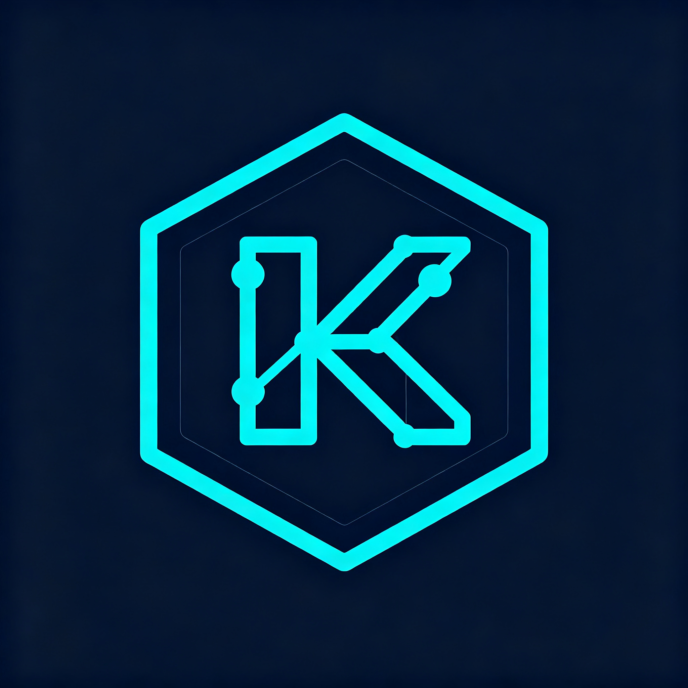

# Kevrai Omni

> 一站式本地 AI 工作站：LLM · 多模态大模型 · TTS · **MiniMax-Music3 音乐生成** · **LTX-2.5 视频生成** · 图像生成 · 超分辨率 · 音频生成 · 3D 生成 · **🤖 Kevrai Agent 智能助手**
> One-stop local AI workstation: LLM, multimodal LLM, TTS, **MiniMax-Music3 music gen**, **LTX-2.5 video gen**, image gen, super-resolution, audio gen, 3D gen, **🤖 Kevrai Agent assistant**.

<p align="center">
  
</p>

**一个安装包 · 桌面快捷方式 · 引擎按需下载 · 模型从 huggingface.co 一键拉取 · 支持本地导入 · 全部开源**

## 🎬 宣传视频 (30 秒 · 1080p)

[](assets/media/promo.mp4)

> 点击播放 [assets/media/promo.mp4](assets/media/promo.mp4)。全部画面取自 v2.8.1 真实运行界面（真实模型目录、真实硬件检测、真实 Agent 工具调用）：模型市场双源检索、硬件体检与模型推荐、Kevrai Agent 工具调用、短剧 Agent、LTX-2.5 视频生成、MNN 引擎。


---

## ✨ v3.1.0 更新亮点（后端可靠性加固 + MNN 子进程隔离）

| 项目 | 说明 |
|---|---|
| 🔒 **MNN 子进程隔离** | opt-in（`KEVRAI_MNN_SUBPROCESS=1`）将 MNN C++ 引擎放入独立 `spawn` 子进程；硬死锁时墙钟超时 `SIGKILL` 并由 OS 回收资源，下次加载自动重建，消除多线程 fork 死锁风险 |
| 🧹 **资源泄漏修复** | 关闭时正确释放 hub 注册表与连接池；多模态临时媒体在成功/失败/取消/断连全路径清理；引擎 download.tmp 失败清理 |
| 🧪 **可靠性验证** | 真实 sidecar 集成冒烟（零孤儿进程）、50 轮资源浸泡（FD/线程/子进程零增长）、25 轮 MNN kill/respawn 高压；全量 **1079 passed**，零新增第三方依赖 |

---

## ✨ v3.0.0 更新亮点（UI/UX 现代化 + 数据事实核验 + 可靠性加固）

| 项目 | 说明 |
|---|---|
| 🎨 **UI/UX 现代化** | 统一内联 SVG 图标集替换 emoji/几何符号，跨平台渲染一致；侧边栏图标补 tooltip 无障碍提示；新增 Ctrl/⌘+K 命令面板（模糊跳转与常用动作）；尊重 prefers-reduced-motion |
| 🪟 **跨平台自定义标题栏** | Linux/Windows 采用无边框自绘标题栏（最小化/最大化/关闭，关闭按钮 hover 警示红），消除系统栏与应用内栏重叠；macOS 保留原生红绿灯 |
| 🧭 **数据事实核验** | 121 模型/32 引擎逐一多源核验，修正 14 处错误 slug（GLM-4.5→zai-org、TripoSR→stabilityai、Open-Sora→hpcai-tech 等），清洗广告软文，移除持续 403 的失效源 |
| 🛡️ **可靠性加固** | 下载器指数退避重试与超时边界、Agent/工具调用异常隔离、hub 摘要 HTML 实体解码（含 XSS 防护）；pip/npm CVE 审计与 CycloneDX SBOM |
| 🎬 **程序化宣传视频** | Remotion 工程可无人值守重渲染，`scripts/render_promo.sh` 仅在内容变化时更新，配合每日定时任务自动刷新 |
| 🧪 **测试加固** | 全量 **940 passed**，`node --check` 全绿，`smoke.sh` 全绿 |

---

## ✨ v2.8.1 更新亮点（全面细化检查 + 引擎/模型对接加固）

| 项目 | 说明 |
|---|---|
| 🔗 **DIY 导入链路打通** | 本地导入的模型此前只能导入、无法运行。现每个导入条目自动标注可用引擎（`.gguf`→llama.cpp、`config.json+*.mnn`→mnn、`model_index.json`→diffusers+transformers、HF 目录→transformers）；新增 `llm-start/stop/status` 运行通道，GGUF 一键启动 llama-server（健康轮询、单实例互斥、退出自动回收）；MNN 页合并展示 DIY 导入的 MNN 目录模型 |
| 🧩 **引擎目录补全** | 新增 `transformers`（pip）与 `gpt-sovits`（源码安装）两个引擎条目，修复 `kokoro-engine` 的 GitHub 死链；模型目录 121 项引擎引用 100% 可解析 |
| 🌐 **镜像源实测清洗** | 注入 98 个经 ModelScope 实测验证的下载源，移除 240 条实测不可达的镜像条目；默认镜像列表只保留存活的 `hf-mirror.com` |
| ⚡ **下载器加固** | 引擎安装支持多候选回退（GitHub 加速前缀）、HTTP Range 断点续传（200-对-Range 自动重置）、实时进度遥测 |
| 🏷️ **版本与 UA 单一来源** | HTTP User-Agent 统一由 `app.USER_AGENT` 派生，清除 6 处历史硬编码漂移（含 `kevrai-studio/2.3.0`、`KevraiStudio/2.3` 等陈旧品牌名与遗留版本号）；新增回归测试锁定「无陈旧 UA 字面量」 |
| 🔒 **并发单例加锁** | 修复 `hub.get_registry` 与 `taxonomy.known_engine_ids` 的 check-then-act 竞态（并发首调用可能重复构建、破坏单例契约），并加并发回归测试 |
| 🧪 **测试加固** | 新增 `test_engines_extreme.py`(7)、`test_local_diy.py`(10)、`test_v281_version_and_locks.py`(9)；全量 **582 passed**，`node --check` 14/14，`smoke.sh` 全绿 |

## ✨ v2.8.0 更新亮点（可插拔技能库 + 短剧编剧方法论）

| 功能 | 说明 |
|---|---|
| 🧩 **可插拔技能系统** | 11 个扁平工具升级为 6 个技能包（核心/模型检索/本机环境/短剧工坊/写作工坊/提示词工坊），Agent 面板新增「🧩 技能库」可按需勾选添加或关闭，状态持久化到 `agent/skills.json`；核心技能不可关闭，跨技能工具名唯一性在构造期强校验；旧的扁平注册表 API 完全保留 |
| 🎬 **短剧编剧方法论移植** | 双基调（微电影三幕式 / 短视频钩子驱动）、9 种情绪节拍库、6 大真人导演流派 + 5 种动画风格锚点、四段产物（梗概/人物小传/场景登记/分场剧本）；场景「先登记后使用」，本地小模型漏登记时自动补登不中断；短剧页新增基调选择与风格锚点下拉 |
| ✍️ **写作工坊（可选技能）** | 大纲骨架、润色清单+文本统计、抽取式摘要、翻译规范；离线确定性可用，加载对话 AI 后 `use_llm` 一键扩写 |
| 🎨 **多模态提示词工坊（可选技能）** | 图像/视频/音乐提示词包，每个结果都含 positive 正向、negative 负面词库、theme_constraints 主题一致性约束，画幅白名单与时长/BPM 钳制，为后续 AI 视频生产提供防变脸/防闪烁/防乱码保障 |
| 🤖 **Agent 规则回退增强** | 系统提示词按已启用技能注入方法论；无 LLM 时新增短剧/提示词/写作三条确定性路由，并给硬件、搜索路由加工具启用守卫，技能关闭后绝不调用缺失工具；工具总数 11→23（默认启用 16） |
| 🧪 **测试加固** | 新增 `test_v280_skills.py`（54 项）覆盖技能管理/持久化/三个工具包/短剧方法论/Agent 集成/HTTP API；全量 **475 passed**，smoke.sh 全绿，含空/超长/非法输入等极端测试 |

## ✨ v2.7.0 更新亮点（Kevrai Agent 通用 AI 助手）

| 功能 | 说明 |
|---|---|
| 🤖 **Kevrai Agent 通用 AI 助手** | 新增侧边栏「AI Agent」标签页：基于 ReAct 循环（Thought→Action→Observation，最多 12 步）的本地 Agent，用自然语言管理模型——硬件检测、模型搜索、智能推荐、下载规划、文本生成；11 个内置工具包装现有 catalog/hardware/download/engine 子系统 |
| 🧠 **双模式推理** | 加载 MNN LLM 模型时进入完整 ReAct 推理模式（多步规划+工具调用）；未加载模型时自动回退 deterministic rule-based 模式（硬件查询→check_hardware、搜索查询→search_models、默认→引导加载模型），零依赖可用 |
| 💾 **SQLite 持久记忆** | 会话历史、消息、用户偏好、任务历史存于 `APP_ROOT/agent/memory.sqlite3`；支持多会话切换、历史消息加载、偏好键值存储 |
| 🌐 **完整 REST + WebSocket API** | 9 个 HTTP 端点（`/api/agent/status`、`/tools`、`/chat`、`/sessions`、`/sessions/{id}/messages`、`/preferences`）+ 1 个 WebSocket（`/ws/agent/{session_id}` 实时流式 step 事件）；与现有 `/v1/*` OpenAI 兼容端点并存，可供 OpenClaw 等外部 Agent 框架直接调用 Kevrai 本地模型 |
| 🎨 **前端对话面板** | 聊天式 UI：消息气泡、工具调用标签、思考状态指示、会话下拉切换、新建会话、Enter 发送/Shift+Enter 换行；暗色主题适配，响应式布局 |
| 🏗️ **架构借鉴 OpenClaw，定制为本地模型管理** | 学习 OpenClaw 2.0（MIT，2026-09-01 发布）的 Gateway+Runtime 分离、本地持久记忆、可插拔工具、模型无关路由设计；不完全照抄——Agent 运行在 Python sidecar 内，工具直接包装 Kevrai 现有子系统，无需额外网关进程 |
| 🧪 **测试加固** | 新增 `test_v270_agent.py`（48 项）：ToolRegistry 8 + parse/extract 5 + AgentMemory 10 + ModelRouter 2 + CatalogTools 6 + SystemTools 6 + RuleBased 6 + ReAct 8（含 MockModelRouter 测试完整循环）；全量 **420 passed** |

## ✨ v2.6.0 更新亮点（MiniMax-Music3 接入 + 新模型 + 全目录核验）
| 新特性 / 修复 | 说明 |
|---|---|
| 🎵 **MiniMax-Music3 全家桶接入并逐条核验** | 官方全精度 `MiniMaxAI/MiniMax-Music3`（8B Global LLM + 0.6B Local LLM + 2.4B Flow Matching + 123M Flow-VAE，32kHz 立体声、单首最长 5 分钟）、ComfyUI 官方重打包、GGUF 量化、Turbo-FP8、W4A8、风格 LoRA、Latent Refiner、MLX 共 8 个条目；配套 `sglang-omni` 引擎与专用 ComfyUI 节点；许可核实为 MiniMax-Music3 Community License（署名 + 2000 万美元营收门槛） |
| 🆕 **新增 13 个 2026 年 5 月后开放权重的高质量模型** | LLM：Granite 4.2 8B/30B、MiniMax M3、Meta Muse Glimmer 30B、DeepSeek-V4-Flash-Vision、GLM-5.3（由「待开源」转正）、Liquid LFM2.5-VL-3B；TTS：MOSS-TTS v1.5、dots.tts-soar；音频：Stable Audio 3 Medium、Google Magenta Realtime 2、MOSS-SoundEffect v2；图像：Krea 2 Turbo。全部经 HuggingFace API 实查存在性、许可、体积、发布时间后入库 |
| 📌 **修正 14 处错误/失效仓库 slug** | DeepSeek-V4-Pro、Qwen3.8-Max→`Qwen3.8-2.4T-A95B`、Qwen3.8-27B 转正官方权重、TRELLIS.2→`TRELLIS.2-4B`、HunyuanImage-3.0→小写 `tencent/`、SeedVR2→`-3B`、Direct3D-S2→`wushuang98`/`DreamTechAI`、TripoSR/TripoSG→`VAST-AI-Research`、chatterbox/IndexTTS/Kokoro 引擎地址、bartowski Mistral GGUF、ACE-Step 1.5、dots3-note、MAGI-2、LingBot 等 |
| 🗑️ 移除虚构条目 | `meta-llama/Llama-4-Multilingual` 在官方模型列表中并不存在（Llama 4 仅 Scout/Maverick），已移除，避免重蹈「幽灵仓库」覆辙 |
| 🧪 测试加固 | 新增 `test_v260_catalog.py`（49 项）：锁定全部修正 slug、新模型字段完整性、Music3 架构事实、引擎地址与目录不变量；全量 **372 passed** |

---

## ✨ v2.5.0 更新亮点（环境随选下载）

| 新特性 | 说明 |
|---|---|
| 🐍 **Python 环境软件内一键安装** | 没装 Python 的 Windows 机器不再报错退出：进入「环境准备」页，一键下载 Python 3.12.7 embeddable（约 11MB，国内镜像三级回退）→ 解压到用户数据目录 → 装 pip → 装运行依赖 → 自动进主界面。安装包依旧小巧，环境与引擎一样随选下载 |
| 🩺 启动诊断增强 | 有 Python 但缺依赖（ModuleNotFoundError）同样进引导页一键补装；stderr 尾部采集辅助定位 |
| 🔒 不污染系统 | 托管 Python 装在用户数据目录，不写注册表、不需要管理员权限 |

---

## ✨ v2.4.2 更新亮点（质量与修复）

| 修复 / 优化 | 说明 |
|---|---|
| 🩹 设置保存崩溃修复 | `PUT /api/settings` 引用不存在的 `max_concurrent` 属性导致保存必 500（v2.4.1 起），已修复 |
| 🔑 HF Token 下发修复 | `SettingsUpdate` 补回 `hf_token` 字段：gated 模型（LTX-2.5）Token 配置链路端到端打通，并有 HTTP 级回归测试 |
| 🐛 converter NameError 修复 | `sys_executable()` 缺 `import sys`，调用即崩，已修复 |
| 🧹 负面提示词清零 | 按用户偏好：LTX 生成不再内置负面提示词默认值，界面文本框留空（字段保留可选） |
| 🧪 死代码清理 | 20+ 处未用导入、xxhash 无效可选导入、多余 global、弃用 utcnow 全部清理，警告 25 → 0 |
| 📄 INSTALL.md 重写 | 安装包 + 快捷方式 + 按需下载 + gated 指引，替换过期的 v2.2.0 便携包说法 |

---

## ✨ v2.4.1 更新亮点（修复优化版）

| 修复 / 优化 | 说明 |
|---|---|
| 📌 目录事实修正 | 修正不存在的 `MiniMaxAI/Hailuo-H3` 仓库（改为 `Comfy-Org/MiniMax-H3` 官方重打包 + `MiniMaxAI/MiniMax-H3` 官方权重双条目）；MiniMax 2K 进展更新至 2026-08-07 官方 AMA 承诺；LTX-2.5 显存门槛修正为官方最低 16GB、许可修正为 LTX-2.x Community License；Qwen3.8-27B 标注社区微调（JonathanColetti）身份与真实仓库 |
| 🔐 gated 仓库下载 | LTX-2.5 等受控访问仓库：设置页新增 HuggingFace Token（仅存本机），下载自动附加 Bearer 认证；未配置时返回明确中文指引（需先在 HF 仓库页接受许可协议） |
| 🔄 引擎更新检测 | 引擎面板新增「检查引擎更新」：查询 GitHub 最新 release，已装引擎显示版本号，发现新版出现徽章并可一键更新；6 小时缓存避免频繁请求 |
| 🏷️ 命名统一 | 产品名统一为 **Kevrai Omni**，与仓库名 kevrai-omni 一致（安装包、快捷方式、窗口标题同步更新） |
| 🧭 新手引导 | 首次启动显示「三步上手」引导：装引擎 → 下模型 → 输提示词 |
| ⚠️ LTX 预设规范 | 低于官方最低 16GB 显存的预设全部标注「实验」，选择时显示提示 |

---

## ✨ v2.4.0 更新亮点

| 新特性 | 说明 |
|---|---|
| 🎥 **LTX-2.5 视频生成运行时** | 内置 Lightricks LTX-2.5 世界模型推理管线：文生视频 / 图生视频，5 档显存预设（4GB–24GB+），进度条、可取消、任务历史、结果画廊，输出 MP4/GIF |
| 🔍 **超级搜索引擎** | 字段加权模糊匹配（名称/ID/标签/引擎/仓库/描述）、拼写纠错（编辑距离 ≤2）、中文 bigram 分词、搜索结果高亮、分面筛选（引擎/许可/体积）、5 种排序、最近搜索、"你是不是要找"建议、键盘导航（`/` 聚焦、↑↓ 选择） |
| ⚡ **性能优化** | HTTP 响应 GZip 压缩、搜索语料内存缓存、`/api/models` 支持排序与仓库字段检索、`disk_usage` 首跑路径不存在时的健壮回退 |
| 📦 **目录扩充** | 110 个模型条目（全部补齐 tags 与 modality 标注）、30 个引擎（新增 `ltx-video` 引擎） |
| 🧪 **测试加固** | 新增 94 个测试（搜索 34 + LTX 运行时 32 + v2.4 API 26），含正则注入、XSS、空字节、超长输入、路径穿越等极端用例；全套 **323 passed / 0 failed** |

---

## 与早期版本的区别

| 维度 | 早期版本 | **本版（Kevrai Omni v2.4.0）** |
|---|---|---|
| 安装形态 | 单 Python 项目 | **Electron 桌面应用 + Windows NSIS .exe 安装包** |
| 视频生成 | 仅目录条目 | **LTX-2.5 一键生成面板**（参数可调、进度、取消、画廊） |
| 搜索 | 名称/描述子串匹配 | **加权模糊搜索**：纠错、中文分词、高亮、分面、排序、历史 |
| 引擎 | 硬编码 diffusers | **引擎市场（按需下载）**：llama.cpp、MNN、vLLM、ONNX Runtime、ComfyUI、**LTX-Video**、TTS/3D 引擎等 30 个 |
| 模型来源 | 视频生成为主 | **121 模型 · 9 大类**，带 tags 与 modality 标注 |
| 安装包大小 | （含模型） | **安装包保持最小**，引擎与模型首次使用时下载到 `AppData/KevraiOmni/` |
| 桌面快捷方式 | 无 | **自动创建桌面 + 开始菜单快捷方式** |
| GGUF 量化 | 无 | **GGUF 全量化浏览**：仓库内全部 `.gguf` 文件单独下载 |
| 本地导入 | 无 | 文件夹/文件一键导入，支持拖拽 |
| 测试 | 无 | **pytest 323 项 + JS 语法冒烟 + 极端输入测试** |

---

## 快速开始

### Windows 用户（普通用户）
1. 从 [Releases](https://github.com/Bullobis/kevrai-omni/releases) 下载 `Kevrai-Omni-3.0.0-x64.exe`（安装包名与 `electron-builder.yml` 的 `artifactName` 模板一致）
2. 双击安装 → 桌面出现 **Kevrai Omni** 快捷方式
3. 启动后 → "AI 引擎"标签 → 安装需要的引擎（如 `llama.cpp`）
4. "模型市场" → 顶部搜索框支持模糊/中文搜索，选模型 → 安装
5. 🎥 **"LTX-2.5 视频"标签** → 输入提示词 → 选显存预设 → 开始生成
   - 首次使用需安装推理引擎：`pip install torch diffusers transformers accelerate imageio imageio-ffmpeg`
6. "本地模型" → 一键导入你的 `model.gguf` / safetensors

### 开发者

> 完整的本地开发环境搭建（Windows / Linux / macOS）、测试与打包细节见
> **[docs/DEVELOPMENT.md](docs/DEVELOPMENT.md)**；sidecar REST/WebSocket 接口见
> **[docs/API.md](docs/API.md)**；常见问题排查见 **[docs/TROUBLESHOOTING.md](docs/TROUBLESHOOTING.md)**。

```bash
git clone https://github.com/Bullobis/kevrai-omni.git
cd kevrai-omni
npm install
cd python && pip install -r requirements.txt && cd ..
npm run dev                 # 启动 Electron 开发模式（sidecar 自动拉起于 127.0.0.1:17890）

# 测试
npm run test:python         # Python pytest
npm run test:js             # JS 语法检查
npm run smoke               # 端到端冒烟（bash scripts/smoke.sh）

# 打包（产物在 build/output/）
npm run build:win           # Windows NSIS .exe
npm run build:linux         # Linux AppImage + deb
npm run build:mac           # macOS .dmg
```

---

## 🎥 LTX-2.5 视频生成

侧边栏点击 **"LTX-2.5 视频"** 打开生成面板：

- **双模式**：文生视频（T2V）/ 图生视频（I2V，需参考图）
- **5 档显存预设**：极致质量(24GB+) / 高质量(16GB) / 平衡(12GB) / 速度(8GB) / 草稿(4GB)
- **完整参数控制**：宽高（自动对齐 32）、帧数（自动对齐 8k+1）、步数、CFG、种子（🎲 随机）、FPS、输出格式（MP4/GIF）
- **显存优化**：VAE 切片、模型 CPU offload 开关
- **任务管理**：实时进度条、步计数、用时、一键取消、最近 10 条任务历史
- **结果画廊**：生成完成自动刷新，内联播放，一键打开输出目录

API（sidecar）：
```
GET  /api/ltx/capabilities      # 能力描述 + 引擎就绪状态
POST /api/ltx/generate          # 提交生成任务
GET  /api/ltx/tasks             # 任务列表 + 当前任务
GET  /api/ltx/tasks/{id}        # 单任务状态
POST /api/ltx/tasks/{id}/cancel # 取消任务
GET  /api/ltx/outputs           # 已生成文件列表
```

---

## 🎞️ Remotion 动画视频（宣传物料）

仓库内置一个独立的 [Remotion](https://www.remotion.dev/) 工程（`remotion/`），
用 React 代码化生成片头动画与版本海报（H.264 MP4），不依赖录制屏：

- `remotion/src/components/GradientBg.tsx` / `ParticleField.tsx` / `TypeWriter.tsx` —— 动态背景素材
- 合成：`LogoIntro`（10s · 1920×1080 · Logo 片头）、`VersionPoster`（15s · 1080×1080 · 版本发布海报）
- `remotion/out/` 已加入 `.gitignore`，渲染产物不进 git，通过 GitHub Release 分发

```bash
cd remotion
npm install
npm run dev          # 打开 Remotion Studio 实时预览 / 调参
npm run render:all   # 渲染全部合成到 remotion/out/*.mp4
# 自定义版本号 / 亮点：
npx remotion render LogoIntro out/logo-intro.mp4 --props='{"version":"v3.0.0"}'
```

`.github/workflows/remotion-render.yml` 会在**每月 1 号 UTC 00:00**（或手动
`workflow_dispatch`）在 Ubuntu runner 上自动渲染两个视频，并上传到最新 GitHub
Release 与 Actions artifact。

生成的 MP4 可用于 GitHub Release 视频、官网首页或宣传物料；这与运行时的
**LTX-2.5 视频生成**（用户在应用内文生/图生视频）相互独立。

---

## 🔍 超级搜索

模型市场顶部工具栏：

- 输入即搜（180ms 防抖），支持**拼写纠错**（`kokro` → Kokoro）、**中文**（`视频`/`语音`）、**多 token 跨字段 AND**（`wan video`）
- 命中关键词在卡片标题/描述中**高亮**
- **分面筛选**：引擎、体积区间，一键切换
- **排序**：相关度 / 热门 / 名称 / 体积大小
- **最近搜索**历史（可清除）+ 零结果时的"你是不是要找"建议
- `按 / 键` 快速聚焦搜索框，`↑↓` 选择，`Enter` 打开，`Esc` 清除

API：`GET /api/search?q=&category=&engine=&license=&size_bucket=&trending=&sort=&page=&page_size=`

---

## 项目结构

```
kevrai-omni/
├── electron/                # Electron 主进程 + preload
│   ├── main.js              # 窗口、spawn Python sidecar、IPC 桥（含搜索/LTX/Agent 通道）
│   └── preload.js           # contextBridge（sandbox=true，入参校验）
├── renderer/                # 渲染层
│   ├── index.html           # 含 LTX-2.5 生成面板
│   ├── app.js               # 模块装配
│   ├── styles.css           # 含搜索下拉/分面/LTX 面板/浅色主题样式
│   └── modules/
│       ├── search.js        # 超级搜索 UI
│       ├── ltx.js           # LTX-2.5 生成面板
│       ├── models.js        # 虚拟滚动网格 + 搜索高亮
│       └── ...
├── python/                  # Python sidecar（FastAPI）
│   ├── app/
│   │   ├── main.py          # HTTP 控制面（/api/*、/v1/*、WebSocket、GZip）
│   │   ├── search.py        # 加权模糊搜索引擎
│   │   ├── ltx_runtime.py   # LTX-2.5 推理任务管理
│   │   ├── catalog.py       # 模型/引擎目录
│   │   ├── engines.py       # 引擎管理器
│   │   ├── importer.py      # HF 下载（断点续传）+ 本地导入
│   │   └── agent/           # Kevrai Agent（ReAct、技能库、SQLite 记忆）
│   └── tests/               # pytest
├── catalog/                 # 静态目录（随安装包发行）
│   ├── models.json          # 模型条目（带 tags/modality）
│   └── engines.json         # 引擎（含 ltx-video、sglang-omni）
├── remotion/                # Remotion 动画视频（Logo 片头 / 版本海报，见下）
├── docs/                    # 开发 / API / 故障排查文档
├── scripts/
│   ├── build_windows.sh     # 打 Windows .exe
│   └── release.sh           # gh release create
├── electron-builder.yml     # NSIS 配置
└── package.json             # v3.0.0
```

---

## 模型市场（catalog/models.json · 121 条目）

按 9 大类组织，指向 huggingface.co 官方或正规社区量化仓库；每个条目均经 HuggingFace/GitHub API 实查核验：

| 类别 | 代表条目 |
|---|---|
| LLM（多模态 + 纯文本） | Qwen3/3.5/3.6/3.8 全系、DeepSeek-V4 Pro/Flash/Flash-Vision、GLM-5/5.2/5.3、Kimi K2.6/K3、**MiniMax M3**、**Granite 4.2 8B/30B**、**Meta Muse Glimmer 30B**、**LFM2.5-VL-3B**、Mistral、Gemma、GPT-OSS |
| TTS | CosyVoice 2/3、Fish Speech 1.5、F5-TTS、Spark-TTS、Kokoro 82M、Chatterbox、IndexTTS、GPT-SoVITS、**MOSS-TTS v1.5、dots.tts-soar** |
| 视频生成 | **LTX-2.5 / LTX-2.3**、MiniMax-H3、Wan 2.2、HunyuanVideo、CogVideoX、Open-Sora 2.0、Step-Video、MAGI-2、LingBot-Video |
| 图像生成 | FLUX.1/FLUX.2、SDXL-Turbo、SD3.5、Kolors、**Krea 2 Turbo**、HunyuanImage 3.0、ControlNet |
| 超分辨率 | Real-ESRGAN、APISR、SUPIR、4x-UltraSharp、SeedVR2-3B/7B |
| 音频/音乐生成 | **MiniMax-Music3 全家桶（8 条目）**、**Stable Audio 3**、**Magenta Realtime 2**、**MOSS-SoundEffect v2**、Stable Audio Open、MusicGen、AudioLDM 2、DiffRhythm、ACE-Step 1.5 |
| 3D 生成 | Hunyuan3D 2.1、TRELLIS / TRELLIS.2-4B、TripoSR、TripoSG、Direct3D-S2、PartCrafter |
| 视觉/多模态工具 | CLIP ViT-L、InsightFace、YOLOv10 |
| 待官方开源 | MiniMax Hailuo 2K、Wan 3.0、HappyShrimp、GLM-5-Code（占位，官方仓库出现后转正） |

外加动态 GGUF 仓库浏览，每次启动从 huggingface.co 拉取文件树，列出**全部 .gguf 文件**单独下载。

---

## 引擎市场（catalog/engines.json · 30 个引擎）

| 类别 | 引擎 |
|---|---|
| LLM | **llama.cpp** · **vLLM** |
| 通用轻量 | **MNN** · **ONNX Runtime** |
| 扩散模型 | **Diffusers** · **ComfyUI** · **LTX-Video Engine (LTX-2.5)** |
| TTS | Kokoro · Fish Speech · F5-TTS · CosyVoice · Spark-TTS · Chatterbox · IndexTTS |
| 3D | Hunyuan3D · TRELLIS · TripoSR · TripoSG · Direct3D-S2 · PartCrafter |
| 视觉 | InsightFace |

**安装包本身不打包这些引擎**——首次使用某类模型时弹窗提示，或在 "AI 引擎" 标签手动预装。

---

## 安全说明

- 模型下载走 **HTTPS**，引擎安装走 **HTTPS**；Electron 侧启用 `contextIsolation`、`sandbox`，preload 对所有 IPC 入参做类型/长度/枚举校验。
- 引擎 ZIP 下载有主机白名单（GitHub / pypi / 正规镜像）；模型仓库 URL 做格式校验。
- 自 v2.2.0 起，镜像采用"建议白名单 + 用户可在设置中自行增删"的模式，不再维护全局硬黑名单；用户对自己添加的源负责。
- 路径类参数（model_id、task_id）统一通过正则白名单校验，阻断路径穿越。

---

## 测试 & 发布

```bash
# Python 测试（303 项，含极端输入）
npm run test:python

# JS 语法冒烟
npm run test:js

# 打 Windows .exe（在 Windows 机器上）
npm run build:win

# 发布到 GitHub Releases
export GITHUB_TOKEN=<你的 PAT>
export REPO=Bullobis/kevrai-omni
bash scripts/release.sh
```

---

## License

**Kevrai Omni itself (source code, documentation, and build artifacts) is licensed under the [Kevrai Omni Community License v2.1](./LICENSE) — a source-available license, full text in English.**

> Source code is public and free for non-commercial use, modification, and distribution. **Commercial use is permitted but requires prior written Commercial Authorization from the Licensor.** Derivative works must be distributed under the same license. To apply for commercial authorization, contact: **2671369836@qq.com**. The Licensor expressly reserves the right to issue cease-and-desist / lawyer's letters (律师函) and pursue legal remedies for unauthorized commercial use.
>
> **v2.1 (2026-09):** The license now spans 19 articles + 6 appendices. v2.0 added data privacy & security (PIPL/GDPR, 72-hour incident notification), responsible AI use & prohibited uses (EU AI Act / China Generative AI Measures), export control & sanctions, contributor license agreement, security-vulnerability safe harbor, commercial-user indemnification, Network Use (SaaS) source disclosure, and liquidated damages. **v2.1 further adds:** anti-evasion / license-integrity rules (no circumvention via affiliates, cloud providers, restructuring, threshold-splitting), AI training/distillation & non-compete restrictions, a precise copyleft boundary (linking/IPC/containers) with an explanatory guide, fork-renaming rules, "Effective Source Code" standard, patent non-assertion covenant, commercial insurance, government-use rules, AI-content labeling/provenance, tiered dispute resolution (negotiation → mediation → PRC court; optional CIETAC arbitration for cross-border), PRC statutory/punitive damages and behavior/evidence/property preservation, plus a commercial-user compliance checklist. See `RELEASE_NOTES_LICENSE_v2.1.md`.

Third-party models, engines, and weights (listed in `catalog/models.json`) are each governed by their own upstream licenses (Apache-2.0, Llama-3, OpenRAIL, Tencent Hunyuan Community, LTX-Open, MusicGen CC BY-NC 4.0, MiniMax-Music3 Community License, etc.), independent of this project's own license. See `NOTICE.md` and `LICENSE` for details.
