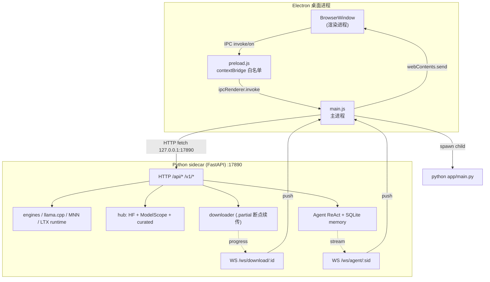

# ARCHITECTURE.md — Kevrai Omni 系统架构

> 本文描述 v2.9.0 的实际架构。所有模块名、端口、路由均来自源码；如与代码漂移，以代码为准。
> 面向想读懂/改代码的工程师；终端用户请见 [DEPLOYMENT.md](./DEPLOYMENT.md)。

## 目录

- [1. 总览](#1-总览)
- [2. 进程与通信](#2-进程与通信)
- [3. Electron 主进程（electron/main.js）](#3-electron-主进程electronmainjs)
- [4. preload 桥（electron/preload.js）](#4-preload-桥electronpreloadjs)
- [5. 渲染进程（renderer/）](#5-渲染进程renderer)
- [6. Python sidecar（python/app/）](#6-python-sidecarpythonapp)
- [7. 模型市场 Hub（多源）](#7-模型市场-hub多源)
- [8. Agent 系统](#8-agent-系统)
- [9. 数据流](#9-数据流)

---

## 1. 总览

Kevrai Omni 是一个 **Electron 桌面壳 + Python 推理 sidecar** 的双进程架构：

- **Electron 主进程**（Node 20.x，随 Electron 33 分发）：管窗口、生命周期、自动更新、把 Python sidecar 当子进程拉起来。
- **渲染进程**（Chromium，原生 JS/HTML/CSS，无前端框架）：UI，约 21 个 ES 模块。
- **preload 桥**（`contextBridge`）：渲染进程拿不到 Node，只能通过白名单 IPC 通道和主进程说话。
- **Python sidecar**（FastAPI + Uvicorn）：真正的控制面——目录、引擎、下载、GPU 探测、推理运行时（llama.cpp / MNN / LTX 等），HTTP + WebSocket 都绑在 `127.0.0.1:17890`。



安全基线（来自 `electron/main.js` 头部注释与 `webPreferences`）：

- `contextIsolation: true`、`nodeIntegration: false`、`sandbox: true`。
- 渲染进程 CSP：`connect-src 'self' http://127.0.0.1:17890 ws://127.0.0.1:17890`——渲染层**只能**连本地 sidecar，不允许任何第三方域名。
- 不加载 `webview` 标签。

---

## 2. 进程与通信

| 项 | 值 | 出处 |
|---|---|---|
| sidecar host | `127.0.0.1`（只监听回环，不对外） | `SIDECAR_HOST` |
| sidecar port | `17890` | `SIDECAR_PORT` |
| sidecar 启动命令 | `python -m uvicorn app.main:app --host 127.0.0.1 --port 17890` | `main.js` spawn 段 |
| 自动重启上限 | `SIDECAR_RESTART_MAX = 3`，线性退避 | `main.js` |
| Python 解释器解析顺序 | `KEVRAI_PYTHON` 环境变量 → 用户数据目录下 `python-runtime/` → 系统 `python3` | `main.js` |
| sidecar 环境变量透传 | `KEVRAI_PORT`、`PYTHONUNBUFFERED=1`、`PYTHONIOENCODING=UTF-8`、`ELECTRON_RUN_AS_NODE=""`，继承 `process.env` | `sidecarEnv()` |
| 日志滚动 | `main.log` → `main.log.1` → `main.log.2`（丢弃最老） | `main.js` |

通信分三类：

1. **渲染 → 主进程**：`ipcRenderer.invoke(channel, ...)`，白名单 channel 前缀 `kevrai:` / `api:` / `dialog:` / `shell:`。
2. **主进程 → sidecar**：普通 HTTP `fetch`（`sidecarFetch()`），以及 WebSocket 订阅下载/Agent 进度。
3. **主进程 → 渲染**：`webContents.send(channel, payload)`，channel 同样白名单（`sidecar:health`、`sidecar:down`、`download:progress`、`bootstrap:progress`、`api:progress:event`）。

---

## 3. Electron 主进程（electron/main.js）

`electron/main.js` 约 1500 行，职责：

| 职责 | 说明 |
|---|---|
| **窗口管理** | `BrowserWindow` 单例；`loadFile(renderer/index.html)`；崩溃/激活时重建窗口。 |
| **CSP 注入** | 作为响应头下发 `RENDERER_CSP`（与 HTML `<meta>` CSP 双保险）。 |
| **sidecar 生命周期** | 找到/引导安装 Python → spawn uvicorn → 健康检查 → 监听 exit → 最多重启 3 次；失败后给渲染进程推 `sidecar:down`。 |
| **Python 引导**（v2.5.0） | 无系统 Python 时下载 `python-3.12.7-embed-amd64.zip`，从 npmmirror / 华为云 / python.org 三镜像轮询，装到 `<userData>/python-runtime/`。 |
| **自动更新** | `electron-updater`，从 GitHub Releases 读 `latest.yml`；`autoDownload=false`（用户确认才下），`autoInstallOnAppQuit=true`。 |
| **IPC handler 注册** | 约 80+ 个 `ipcMain.handle("kevrai:...", ...)` / `ipcMain.handle("api:...", ...)`，要么自己处理（对话框、shell、设置），要么转发到 sidecar HTTP。 |
| **日志** | 写到 `<userData>/logs/main.log`，按大小滚动；sidecar stdout/stderr 也进同一日志。 |
| **Token 同步** | 用户在 UI 填的 HF/ModelScope token 不存主进程，save 后 best-effort `POST /api/settings` 推给 sidecar。 |

数据目录（`settings.py` 的 `default_data_root()`）：

| 平台 | 根 |
|---|---|
| Windows | `%APPDATA%\KevraiOmni\` |
| macOS | `~/Library/Application Support/KevraiOmni\` |
| Linux | `~/.local/share/KevraiOmni\`（或 `$XDG_DATA_HOME`） |

---

## 4. preload 桥（electron/preload.js）

`preload.js` 通过 `contextBridge.exposeInMainWorld("kevrai", api)` 暴露**唯一**全局对象 `window.kevrai`。每个方法在 invoke 前做入参校验（`assertString` / `assertEnum` / `assertObject`），错误归一化成普通 Error reject。

API 面按域分组（节选自 `preload.js` 实际导出）：

| 域 | 方法（节选） |
|---|---|
| 应用/更新 | `getAppVersion`、`checkUpdates`、`downloadUpdate`、`installUpdate` |
| 设置 | `getSettings`、`putSettings`、`detectGPU`、`openPath`、`showErrorDialog`、`openExternal`、`logEvent` |
| 目录/模型 | `health`、`categories`、`models`、`modelDetail`、`modelGgufFiles`、`ggufRepos`、`localModels`、`importModel`、`progress` |
| 引擎 | `engines`、`installEngine`、`uninstallEngine`、`checkEngineUpdates`、`updateEngine` |
| 环境引导 | `envStatus`、`installPythonRuntime`、`installPythonDeps`、`bootstrapStatus`、`bootstrapRetry`、`onBootstrapProgress` |
| 硬件/推荐 | `hardware`、`recommend`、`measureSources`、`getSourceRegistry`、`getSourceHealth`、`lockSource` |
| MNN | `mnnModels`、`mnnModelFiles`、`mnnStatus`、`mnnLoad`、`mnnUnload`、`mnnChat`、`mnnDownload`、`mnnLocal` |
| llama.cpp LLM | `llmStart`、`llmStop`、`llmStatus` |
| 格式转换 | `convertCapabilities`、`convertStart`、`convertTasks`、`convertTask`、`convertCancel` |
| 短剧工坊 | `dramaOptions`、`dramaStorycraft`、`dramaBrainstorm`、`dramaScript`、`dramaStoryboard`、`dramaRenderPlan` |
| Agent | `agentStatus`、`agentChat`、`agentSessions`、`agentSessionMessages`、`agentGetPreferences`、`agentSetPreference`、`agentSkills`、`agentToggleSkill`、`agentResetSkills` |
| 技能市场 | `skillHubList`、`skillHubImportDir`、`skillHubImportZip`、`skillHubImportGit`、`skillHubRemove` |
| 超级搜索 | `search`、`searchRecent`、`searchClearRecent` |
| 双源 Hub | `hubSources`、`hubHealth`、`hubSearch`、`hubModel`、`hubFiles`、`hubDownload`、`hubJob` |
| LTX-2.5 视频 | `ltxCapabilities`、`ltxGenerate`、`ltxTasks`、`ltxTask`、`ltxCancel`、`ltxOutputs` |
| 下载 | `startDownload`、`cancelDownload`、`onDownloadProgress`、`onProgress` |
| 对话框 | `pickFolder`、`pickFile` |
| 事件订阅 | `onHealth`、`onSidecarDown`、`onDownloadProgress`、`onBootstrapProgress` |

> 渲染进程**拿不到** `ipcRenderer` 对象本身，只能调这些白名单方法。

---

## 5. 渲染进程（renderer/）

原生 ES Module，无打包器。入口 `renderer/index.html` → `renderer/app.js` 装配 `renderer/modules/*.js` 下 21 个模块。

| 模块 | 职责（取自文件头注释） |
|---|---|
| `api.js` | 对 `window.kevrai` 的 typed-ish 封装；统一错误 toast；调用方负责解包 `{status, body}`。 |
| `state.js` | 极简共享 store + 订阅通知。 |
| `toast.js` | 右上角 toast 栈（最多 4 条，4s 自动消失）。 |
| `net.js` | IPC 响应解包 + 文本工具（`unwrap`、`escapeHtml`）。 |
| `debounce.js` | 防抖工具。 |
| `theme.js` | 根据设置应用 light/dark/system 主题。 |
| `onboarding.js` | 首次启动三步引导（装引擎 → 下模型 → 生成）。 |
| `models.js` | 侧边栏搜索 + 模型网格（虚拟滚动）+ 详情面板。 |
| `virtual-grid.js` | 基于绝对定位的 DOM 虚拟化（无 IntersectionObserver）。 |
| `engines.js` | 引擎面板：安装/卸载/更新/检查更新。 |
| `downloads.js` | 下载遮罩层 + 订阅主进程进度事件。 |
| `dragdrop.js` | 拖拽模型文件导入。 |
| `search.js` | 超级搜索 UI：加权模糊、分面、排序、最近搜索、did-you-mean、键盘导航。 |
| `hardware.js` | 硬件快照展示 + 智能模型推荐页。 |
| `environments.js` | 应用内环境/依赖检测页，缺什么装什么；多源镜像选择器。 |
| `settings.js` | 设置浮层（打开/保存）。 |
| `update.js` | 自动更新 UI：检查 → 下载进度 → 重启安装。 |
| `mnn.js` | MNN 引擎页：安装/市场/下载/加载/对话。 |
| `ltx.js` | LTX-2.5 视频生成面板（t2v/i2v）。 |
| `generation-wait.js` | 生成等待动画遮罩。 |
| `agent.js` | Kevrai Agent 助手面板（ReAct 循环 UI）。 |

---

## 6. Python sidecar（python/app/）

FastAPI 应用在 `python/app/main.py`（约 120 KB），`app = FastAPI(title="Kevrai Omni Sidecar", lifespan=_lifespan)`。

### 6.1 路由一览（按域分组）

| 域 | 方法 + 路径 | 说明 |
|---|---|---|
| 健康/目录 | `GET /api/health`、`GET /api/categories`、`GET /api/models`、`GET /api/models/local`、`GET /api/models/{id}`、`GET /api/models/{id}/gguf-files`、`GET /api/gguf-repos`、`POST /api/models/import` | 静态目录 + 本地注册 |
| 引擎 | `GET /api/engines`、`POST /api/engines/install`、`POST /api/engines/update`、`POST /api/engines/check-updates` | EngineManager |
| 进度 | `GET /api/progress` | 轮询兜底 |
| GPU/硬件 | `GET /api/gpu`、`GET /api/hardware`、`GET /api/recommend` | gpu.py / hardware.py / recommend.py |
| 环境 | `GET /api/env/status`、`POST /api/env/install`、`POST /api/env/upgrade`、`POST /api/env/install-engine` | env.py |
| 设置 | `GET /api/settings`、`PUT /api/settings` | settings.py 原子写 |
| 双源 Hub | `GET /api/hub/sources`、`GET /api/hub/health`、`GET /api/hub/search`、`GET /api/hub/model`、`GET /api/hub/model/files`、`POST /api/hub/download`、`GET /api/hub/jobs/{id}` | hub/ 包 |
| 下载 | `POST /api/download/start`、`GET /api/download/{id}`、`POST /api/download/{id}/cancel`、`WS /ws/download/{id}` | downloader.py |
| 源调度 | `POST /api/sources/measure`、`GET /api/sources/registry`、`GET /api/sources/health`、`POST /api/sources/lock` | source_scheduler.py |
| MNN | `GET /api/mnn/models`、`GET /api/mnn/models/{id}/files`、`GET /api/mnn/status`、`POST /api/mnn/load`、`POST /api/mnn/unload`、`POST /api/mnn/chat`、`POST /api/mnn/download`、`POST /api/mnn/download/cancel`、`GET /api/mnn/download`、`GET /api/mnn/local` | mnn_runtime.py |
| 格式转换 | `GET /api/convert/capabilities`、`POST /api/convert/start`、`GET /api/convert/tasks`、`GET /api/convert/{id}`、`POST /api/convert/{id}/cancel` | converter.py |
| 短剧工坊 | `GET /api/drama/options`、`GET /api/drama/storycraft`、`POST /api/drama/brainstorm`、`POST /api/drama/script`、`POST /api/drama/storyboard`、`POST /api/drama/render-plan` | drama.py |
| OpenAI 兼容 | `GET /v1/models`、`POST /v1/chat/completions` | 给外部客户端用 |
| 超级搜索 | `GET /api/search`、`GET /api/search/recent`、`DELETE /api/search/recent` | search.py |
| LTX 视频 | `GET /api/ltx/capabilities`、`POST /api/ltx/generate`、`GET /api/ltx/tasks`、`GET /api/ltx/tasks/{id}`、`POST /api/ltx/tasks/{id}/cancel`、`GET /api/ltx/outputs` | ltx_runtime.py |
| Agent | `GET /api/agent/tools`、`GET /api/agent/status`、`GET /api/agent/skills`、`POST /api/agent/skills/reset`、`GET /api/agent/skill-hub`、`POST /api/agent/skill-hub/import`、`POST /api/agent/skill-hub/import-zip`、`POST /api/agent/skill-hub/import-git`、`DELETE /api/agent/skill-hub/{id}`、`POST /api/agent/skills/{id}`、`POST /api/agent/chat`、`GET /api/agent/sessions`、`GET /api/agent/sessions/{id}/messages`、`DELETE /api/agent/sessions/{id}`、`GET /api/agent/preferences`、`PUT /api/agent/preferences`、`WS /ws/agent/{session_id}` | agent/ 包 |

### 6.2 WebSocket 消息

- `/ws/download/{task_id}`：下载进度推送（事件：`started`、`progress`、`done`、`error`）。
- `/ws/agent/{session_id}`：Agent ReAct 步骤流式推送（每步 `thought` / `action_tool` / `observation`）。

### 6.3 关键模块

| 文件 | 职责 |
|---|---|
| `main.py` | FastAPI 应用装配、路由、生命周期。 |
| `catalog.py` | 读 `catalog/models.json`（121 模型）+ `catalog/engines.json`（32 引擎），带版本/更新元数据。 |
| `engines.py` | EngineManager：引擎安装/卸载/更新，落到 `<data_root>/engines/`。 |
| `downloader.py` | 分片下载：写 `.partial` → fsync → 原子 rename；续传用 `Range: bytes=n-`；取消用协作标志位。 |
| `gpu.py` | GPU 探测：nvidia-smi / rocm-smi / npu-smi / system_profiler，全部 try/except 包裹。 |
| `hardware.py` | CPU / 内存 / 磁盘 / 网络带宽探测。 |
| `settings.py` | Pydantic Settings 模型，原子写 `settings.json`。 |
| `importer.py` | 本地模型文件导入（路径安全校验防 Zip Slip / 目录穿越）。 |
| `ltx_runtime.py` | LTX-2.5 视频生成任务管理；torch 惰性导入；按 VRAM 选预设。 |
| `mnn_runtime.py` / `mnn_catalog.py` | MNN 引擎运行时与模型目录。 |
| `converter.py` | 模型格式转换任务。 |
| `drama.py` | 短剧工坊：头脑风暴 → 剧本 → 分镜 → 渲染计划。 |
| `search.py` | 加权模糊搜索 + 分面。 |
| `source_scheduler.py` / `sources.py` / `sources_registry.py` | 多源测速、健康冷却、EWMA 调度。 |

### 6.4 引擎运行时

引擎本身**不随 sidecar 代码分发**——它们由 `engines.py` 从目录登记的 URL 下载到 `<data_root>/engines/`，再由 sidecar 按需要加载：

- **llama.cpp**：GGUF 推理主引擎。
- **MNN**：MNN 引擎，对应 `mnn_runtime.py`。
- **LTX/diffusers**：torch 惰性导入，按 VRAM 档位切预设。
- 其余 30 个引擎（vllm、sglang、ollama、comfyui、kokoro、fish-speech、hunyuan3d、trellis 等）在 `catalog/engines.json` 登记，按需安装。

---

## 7. 模型市场 Hub（多源）

`python/app/hub/` 包，三个数据源（`hub/base.py`）：

| Hub ID | 显示名 | 优先级 |
|---|---|---|
| `curated` | 官方策展目录（catalog/models.json） | 0 |
| `modelscope` | 魔搭 ModelScope | 1 |
| `hf` | HuggingFace（含 hf-mirror.com 镜像） | 2 |

机制：

- **多源聚合**：`hub/registry.py` 把 curated / ModelScope / HF 三路结果合并去重。
- **测速**：`sources.py` 对每个源并发探针（`probe_concurrency=8`），小文件走延迟曲线、大文件走吞吐曲线；结果 EWMA 平滑、缓存 300s。
- **断点续传**：`downloader.py` 用 `.partial` + `Range` 头续传（见 6.3）。
- **gated 仓库**：HF gated 模型（如 LTX-2.5）需要 token；token 从 sidecar 设置读。
- **用户可锁源**：`locked_source` 设置项强制某源优先；连续失败 3 次进入 300s 冷却。

---

## 8. Agent 系统

`python/app/agent/`：

- **ReAct 循环**（`agent.py`）：reason → act → observe，每步记录 `AgentStep{iteration, thought, action_tool, action_params, observation}`；有最大迭代上限防止死循环；tool observation 有最大字符截断。
- **记忆**（`memory.py`）：SQLite，四张表——`sessions`、`messages`、`preferences`、`task_history`。
- **工具**（`tools/`）：`catalog_tools.py`（查模型/引擎）、`drama_tools.py`（短剧）、`media_prompt_tools.py`、`system_tools.py`、`writing_tools.py`。
- **技能插件**（`skill_hub.py`）：从本地目录 / zip / git URL 导入外部 `SKILL.md` 技能；用户可启用/禁用/重置。
- **流式**：`/ws/agent/{session_id}` 把每一步推给 UI。

---

## 9. 数据流

以「用户在模型市场点下载一个 GGUF 模型」为例：

```
用户点击 [下载]
  → renderer/modules/models.js 调 window.kevrai.hubDownload({hub, repo, files})
  → preload.js 入参校验后 ipcRenderer.invoke("kevrai:hub-download", clean)
  → main.js 里的 ipcMain.handle("kevrai:hub-download") 转发为 HTTP POST /api/hub/download 到 127.0.0.1:17890
  → sidecar: hub/registry.py 选源 → downloader.py 开分片下载（.partial）
  → sidecar: WS /ws/download/{id} 推进度事件
  → main.js 收到 WS 消息 → webContents.send("download:progress", payload)
  → preload.js 的 listen("download:progress") 转发给渲染回调
  → renderer/modules/downloads.js 刷新进度条
  → 下载完成 → sidecar 原子 rename .partial → 正式文件 → 推 done 事件
  → UI 提示「安装完成」
```

生成类请求（对话 / 视频 / 图像）路径相同，只是终点换成 `llmStart` / `ltxGenerate` / `mnnChat` 等路由，结果通过任务轮询或 WS 流回推。
