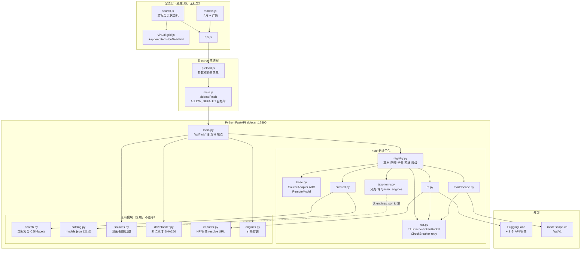
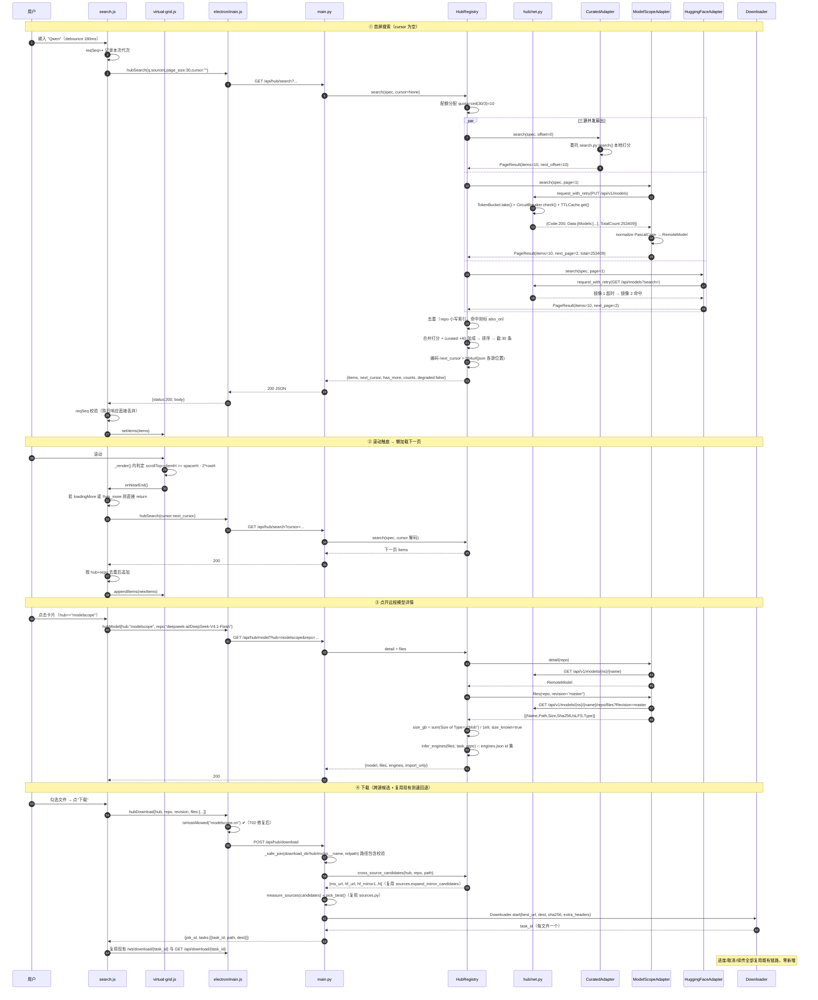
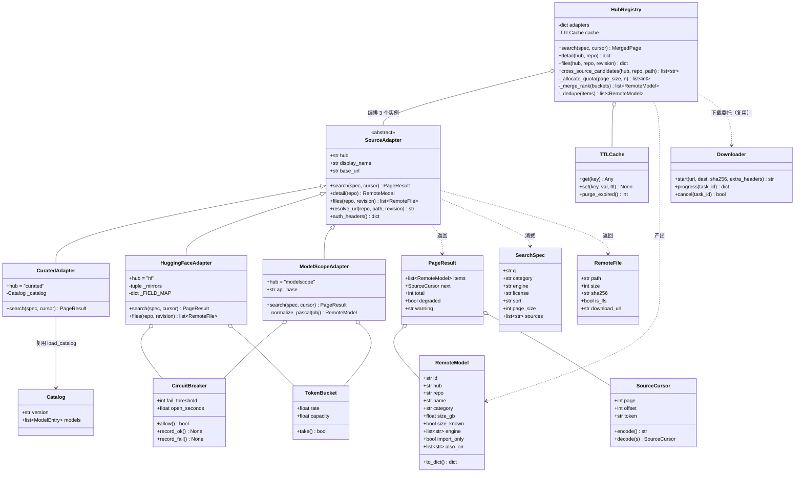
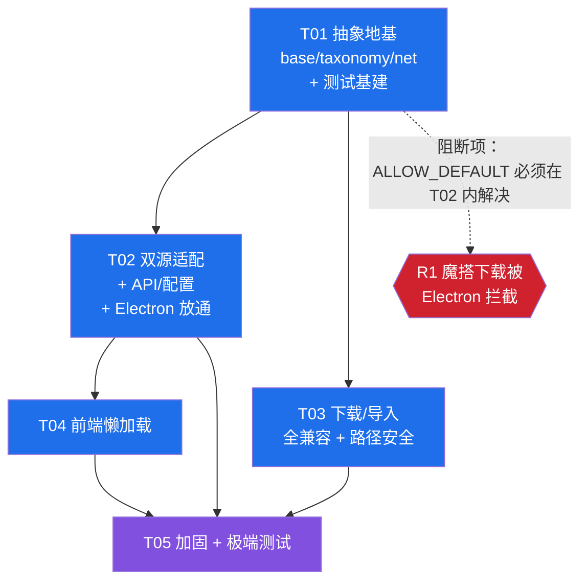

# Kevrai Omni v2.8.0 双源（HuggingFace + 魔搭）对接设计

> ｜　基线提交：`5156e9c`（v2.7.0）　｜　状态：设计稿，本轮不改任何源码
>
> **取证声明**：本文所有对现有代码的论断均来自本轮实际读取的文件与实测执行结果，行号基于提交 `5156e9c`。
> 魔搭 API 事实采信交付总监的 curl 实测结论。凡未经验证的外部接口细节，一律显式标注 **【待确认】**，
> 不做推测性断言。

---

## 0. 执行摘要

| 项 | 结论 |
|---|---|
| 新增文件 | **11 个**（Python 8 + 测试 3） |
| 修改文件 | **13 个**：源码 10（`main.py`、`settings.py`、`catalog.py`、`engines.py`、`sources.py`、`electron/main.js`、`electron/preload.js`、`renderer/modules/{virtual-grid,search,models}.js`）+ 模板 1（`renderer/index.html`）+ 配置 2（`pyproject.toml`、`package.json`） |
| 核心抽象 | `SourceAdapter` 抽象基类 + `RemoteModel/RemoteFile/PageResult` 归一化数据结构 + `HubRegistry` 编排器 |
| 复用策略 | 检索复用 `search.py` 打分、下载复用 `downloader.py`+`sources.py` 三级镜像回退、前端复用 `virtual-grid.js` |
| 新增端点 | `/api/hub/*` 共 6 个，**全部为新增路径**，现有 60+ 路径与响应结构零改动 |
| 任务批次 | **5 批**（T01 抽象地基 → T02 API/配置 → T03 下载兼容 → T04 前端懒加载 → T05 加固与测试） |
| 最高风险 | `electron/main.js:39` `ALLOW_DEFAULT = ["huggingface.co","github.com"]` —— 魔搭下载会被 Electron 层直接拒绝（详见 §6.1） |

### 0.1 本轮勘察发现的两个"设计改道"级事实

**发现 A（阻断级）**：`electron/main.js:39` 定义 `const ALLOW_DEFAULT = ["huggingface.co", "github.com"];`，
而 `electron/main.js:943-950` 的 `kevrai:start-download` 处理器强制校验：

```js
assert(u.protocol === "https:", "download.url: only https allowed");
const host = u.hostname.toLowerCase();
assert(isHostAllowed(host, settings), `download.url: host "${host}" not in allowlist`);
```

`isHostAllowed`（`main.js:550-556`）按后缀匹配该列表。**结论：即使 Python 侧 `catalog.py:44-45` 已允许
`modelscope.cn` / `www.modelscope.cn`，走渲染层 `api.startDownload()` 的魔搭下载今天会 100% 被 Electron 主进程拦下。**
这是"全部兼容"的头号阻断点，必须列为 P0（T02）。项目存在**双层白名单**（Electron 层 + Python 层），
两层都要放通才算通。

**发现 B（影响 Token 方案选型）**：渲染层的 `api.getSettings()/putSettings()` **不走 Python sidecar**。
`electron/main.js:936-941` 的 `kevrai:get-settings` / `kevrai:put-settings` 调用的是 Electron 本地的
`loadSettingsSync()` / `saveSettings()`（`main.js:138-157`），读写 Electron 自己的 `SETTINGS_PATH`，
与 Python 的 `settings.json` 是**两套独立存储**。且 `saveSettings` 的持久化键白名单为：

```js
const allowed = ["theme", "hardwareAccel", "telemetry",
                 "allowlistAdvanced", "allowlist", "modelDir", "engineDir"];
```

**`hfToken` 不在该白名单内**（尽管 `DEFAULT_SETTINGS.hfToken` 在 `main.js:135` 有定义）。
同时 `renderer/modules/settings.js:52` 读的是 `s.hfToken`（camelCase），而 Python `/api/settings`
返回的是 `hf_token`（snake_case）。

由此得到两个直接推论：

1. **P0 安全项"`/api/settings` 明文回吐 HF Token"的修复是零前端风险的** —— 渲染层从来没有从
   Python `/api/settings` 读过 token（字段名都不匹配，且根本没调这个端点）。可以放心改成脱敏返回。
2. UI 里输入的 HF Token **今天不会被持久化**（既没进 Electron 白名单，也没送到 Python）。
   `ms_token` 的设计必须打通这条链路，否则会重复同一个坑。列为 T02 的验收项。

---

## 1. 总体架构

### 1.1 设计原则

1. **加法优先**：新能力全部落在新的 `python/app/hub/` 子包 + `/api/hub/*` 路由下。现有模块只做
   "加字段 / 加分支"级改动，不改任何已有函数签名与响应结构。
   （子包形式有现成先例：`python/app/agent/` 已是子包。）
2. **纯函数优先**：字段归一化、引擎推断、分类映射、合并排序全部实现为**无网络、无 IO 的纯函数**，
   使极端测试可以 100% 离线覆盖。
3. **网络只在 Adapter 边界**：只有 `hub/hf.py` 与 `hub/modelscope.py` 里的 `_fetch` 会发 HTTP。
   两者都必须支持注入 `base_url` 与 `httpx.AsyncClient`，否则测试无法离线（硬性要求，见 §6.3）。
4. **降级永不 5xx**：在线检索失败时返回 HTTP 200 + `degraded: true` + 本地策展结果，
   市场页永远能渲染。受限网络下产品仍可用。

### 1.2 核心抽象：`SourceAdapter`

统一三件事：**检索（列表分页）**、**详情**、**文件清单**。三个源共用同一接口：

| 实现 | 说明 |
|---|---|
| `CuratedAdapter` | 本地策展 `catalog/models.json`（121 条，实测）。不发网络，内部委托 `search.py:search()` |
| `HuggingFaceAdapter` | HF API，镜像轮转复用 `importer.py:403-407` 的 `_HF_API_MIRRORS` |
| `ModelScopeAdapter` | 魔搭 `/api/v1/`，字段 PascalCase |

```python
# python/app/hub/base.py（新增，示意签名）
class SourceAdapter(ABC):
    hub: str                      # "curated" | "hf" | "modelscope"
    display_name: str

    @abstractmethod
    async def search(self, q: SearchSpec, cursor: SourceCursor) -> PageResult: ...
    @abstractmethod
    async def detail(self, repo: str) -> RemoteModel: ...
    @abstractmethod
    async def files(self, repo: str, revision: str = "") -> list[RemoteFile]: ...
    def resolve_url(self, repo: str, path: str, revision: str = "") -> str: ...
```

**关键设计：不把远程条目塞进 `catalog.ModelEntry`。** 原因有二（均为实测确认）：

1. `ModelEntry.id` 有校验器 `catalog.py:119-124`（`_id_safe`），正则 `^[A-Za-z0-9._-]{1,128}$` ——
   远程 id 形如 `deepseek-ai/DeepSeek-V4.1-Flash`，含 `/`，**构造即失败**。
   本轮实测：`ModelEntry(id='deepseek-ai/DeepSeek-V4.1-Flash', ...)` 抛
   `pydantic.ValidationError`（内层为 `ValueError: unsafe model id`）—— 注意捕获时应捕
   `ValidationError`，写 `except ValueError` 抓不到。
2. `ModelEntry.source` 字段被 `catalog.py:126-130` 的 `_url_optional` 校验器归为 **URL 类字段**
   （与 `repo`/`gguf_repo`/`primary_url` 同组）。因此**绝对不能**把 `"hf"`/`"modelscope"` 写进 `source`。
   → 新增独立字段 **`hub`** 标记来源。
   ⚠️ **该约束无运行期保护**：本轮实测 `ModelEntry(..., source='modelscope')`
   **静默通过**（`_url_optional` 只做 `.strip()`，从不抛异常），且 121 条策展条目**全部未设 `source`**。
   违反此约定不会有任何报错，只能靠测试 E27 兜住（见 §6.4）。

所以远程条目用新的 `RemoteModel` dataclass，序列化后是 `ModelEntry.model_dump()` 的**超集**，
保证前端 `renderCard()`（`models.js:31-71`）读的每个字段都在。

### 1.3 归一化数据结构

```python
@dataclass
class RemoteModel:
    # --- 前端卡片必需（与 ModelEntry 同名同义，renderCard 零改动即可渲染）---
    id: str                 # 合成安全 id，见 §1.4
    name: str
    description: str
    category: str           # 映射到现有 9 类，未知 → "other"
    license: str
    size_gb: float          # 未知时为 0，配合 size_known=False
    engine: list[str]       # 由 infer_engines() 推断
    trending: bool
    repo: str               # "owner/name" 原始全名
    hardware: dict          # 远程源无此数据 → {}
    tags: list[str]
    modality: dict
    # --- 新增字段（前端可选读取）---
    hub: str                # "curated" | "hf" | "modelscope"
    size_known: bool
    downloads: int
    likes: int              # HF likes / 魔搭 Stars
    revision: str           # HF "main" / 魔搭 "master"
    task: str               # 原始任务标签，保留供排障
    also_on: list[str]      # 同一模型还存在于哪些源（去重合并的产物）
    import_only: bool       # 无法推断引擎时为 True
```

### 1.4 远程 id 的安全合成（绕开 `_validate_model_id`）

`main.py:372` 的 `_MODEL_ID_RE = ^[A-Za-z0-9._-]{1,128}$` 被 `_validate_model_id()`（`main.py:377-383`）
用于 `/api/models/{model_id}`、`/api/models/{model_id}/gguf-files`。含 `/` 的远程 id 会被 400 拒绝。

**方案**：双轨制，互不干扰。

- 合成 id：`f"{prefix}-{hashlib.sha1(f'{hub}/{repo}'.encode()).hexdigest()[:16]}"`
  例：`hf-3f2a9c1b7d4e5a60`、`ms-8b1c0d2e3f4a5b67`。满足现有正则，可安全用作 DOM key / 选中态 / 去重键。
- 详情/文件查询**不走路径参数**，改用新端点的 **query 参数**传原始 `repo`：
  `GET /api/hub/model?hub=modelscope&repo=deepseek-ai/DeepSeek-V4.1-Flash`
  —— 斜杠天然合法，无需反查哈希，也不引入任何路由歧义。

**收益：`/api/models/{model_id}` 一行都不用改。**

### 1.5 本地策展与在线结果的共存

`catalog/models.json` 实测：`version 2.7.0`、**121 个模型**、2 个 `gguf_repos`，
分类分布 `{llm:44, audio:17, 3d:17, tts:11, video:11, image:9, superres:5, pending:4, vision:3}`。
这 121 条是**人工核验过的高价值资产**（带 `hardware` 建议配置、`modality`、精确 `engine`），
远程 25 万条没有这些。因此：

- **策展优先**：合并排序给 `hub=="curated"` 固定 `+40` 分加成（§2.4），第一页几乎总是策展结果打头。
- **去重**：把 `repo` / `gguf_repo` / `mnn_repo` 规范化为小写 `owner/name` 建索引；远程条目命中索引则
  **丢弃远程条目**，并给本地条目追加 `also_on: ["hf","modelscope"]`。用户看到的是"一个模型"，
  而不是三条重复卡片。
- **`/api/search` 保持只查本地**：它的 `facets` 语义是"全量精确计数"（`search.py:357-375` 遍历全集），
  25 万条上无法维持该语义。在线检索一律走新端点 `/api/hub/search`，facets 降级为
  "已加载范围内计数"并显式标注 `facets_scope`（§2.3）。

### 1.6 字段归一化映射表

#### 魔搭 → 归一化（基于交付总监 curl 实测的 PascalCase 响应）

| 归一化字段 | 魔搭来源 | 转换规则 |
|---|---|---|
| `repo` | `Path` + `Name` | `f"{Path}/{Name}"`，如 `deepseek-ai/DeepSeek-V4.1-Flash` |
| `name` | `Name`，回退 `ChineseName` | 去空白 |
| `description` | `Description` | 截断 2000 字符 |
| `license` | `License` | 小写归一：`"mit"` → `"MIT"`（见 `LICENSE_CANON` 表） |
| `downloads` | `Downloads` | `int()`，缺省 0 |
| `likes` | `Stars` | `int()`，缺省 0 |
| `category` | `Tasks[].DomainName` + `Tasks[].Name` | 见下方分类映射 |
| `task` | `Tasks[0].Name`，回退 `Tasks[0].ChineseName` | 原样保留 |
| `revision` | `Revision` | 缺省 `"master"` |
| `size_gb` | **无此字段** | 列表阶段恒为 `0`，`size_known=False`；详情页按文件清单 `Size` 求和补全 |
| `trending` | 派生 | `Downloads >= 100000`（本地阈值，不依赖上游字段） |
| `tags` | `Tasks[].Name` + `Frameworks` + `Architectures` | 扁平化去重 |

> **注意**：`Tasks` 是**数组且元素是对象**（实测 `[{"ChineseName":"视觉多模态理解","DomainName":"multi-modal","Id":295}]`），
> 归一化函数必须对 `Tasks` 为 `None` / `[]` / 元素非 dict 三种情况做防御（极端测试 E-07 覆盖）。

#### HF → 归一化

**已由现有代码证实的部分**（可直接采信）：

- 文件清单：`GET {mirror}/api/models/{repo}/tree/main?recursive=true`，元素含 `type`（`"file"`）、
  `path`、`size`；翻页游标在响应头 `x-next-cursor`。依据：`importer.py:410-446`。
- 下载直链：`{host}/{repo}/resolve/{revision}/{quote(filename)}`。依据：`importer.py:456-458`。
- 镜像列表：`hf-cdn.sufy.com` → `hf-mirror.com` → `huggingface.co`。依据：`importer.py:403-407`。

**【待确认】HF 搜索列表接口的字段名与翻页机制**：本轮未做 curl 实测，交付总监也未提供 HF 侧实测事实。
预期使用 `GET /api/models?search=&limit=&full=1`，字段为 snake_case（`id`/`author`/`downloads`/`likes`/
`tags`/`pipeline_tag`/`lastModified`/`siblings`）。**实现前必须先做一次一次性实测**（T01 验收项 A1），
并把所有字段名集中放在 `hub/hf.py` 顶部的 `_HF_FIELD_MAP` 常量里，正文一律用
`_pick(obj, _HF_FIELD_MAP["downloads"], default=0)` 取值，做到"实测后只改一处常量"。
归一化函数对任何字段缺失都必须返回默认值而非抛异常。

#### 分类映射（`hub/taxonomy.py`，纯函数、可离线测）

目标是现有 9 类（`main.py:411-423` 的 `/api/categories`）：
`llm / tts / video / image / superres / audio / 3d / vision / pending`。

| 上游信号 | → category |
|---|---|
| HF `pipeline_tag` ∈ {`text-generation`,`text2text-generation`,`question-answering`,`fill-mask`} | `llm` |
| HF `text-to-speech`,`text-to-audio` ／ 魔搭 domain `audio` + 任务含 `tts`/`语音合成` | `tts` |
| HF `automatic-speech-recognition`,`audio-classification` ／ 魔搭 domain `audio` | `audio` |
| HF `text-to-video`,`image-to-video` ／ 魔搭任务含 `video`/`视频` | `video` |
| HF `text-to-image`,`image-to-image`,`unconditional-image-generation` | `image` |
| HF `image-super-resolution` ／ 任务含 `super-resolution`/`超分` | `superres` |
| HF `image-to-3d`,`text-to-3d` ／ 魔搭 domain `3d` | `3d` |
| HF `image-classification`,`object-detection`,`image-segmentation`,`image-text-to-text` ／ 魔搭 `cv`,`multi-modal` | `vision` |
| 其它 / 缺失 | `other` |

**`other` 是新增第 10 类**，需追加到 `/api/categories` 返回列表。这是**纯加法**：
`renderer/modules/models.js:104-115` 的 `populateCategoryFilter()` 是从 API 动态生成 `<option>` 的，
新增一项会自动出现在下拉框，无需改前端。且 `search.py:_passes_filters`（`search.py:443-458`）
按字符串相等过滤，新增值不影响既有过滤逻辑。

### 1.7 引擎推断：`infer_engines()` —— "全部兼容"的落点

纯函数，签名 `infer_engines(files: list[str], task: str, repo: str, platform: str) -> tuple[list[str], bool]`
（返回 `(engines, import_only)`）。**按文件格式而非猜测来分派**：

| 判据（按优先级） | → engine 候选 | 依据 |
|---|---|---|
| 任一文件 `*.gguf` | `["llama.cpp", "ollama"]` | `engines.json` 实测含此两 id |
| 任一文件 `*.mnn`，或 `repo` 的 namespace ∈ {`MNN`,`taobao-mnn`}，或名字以 `-MNN` 结尾 | `["mnn"]` | `mnn_catalog.py:26,30-32` 已用此约定 |
| 任一文件 `*.onnx` | `["onnxruntime"]` | `engines.json` 含 `onnxruntime` |
| `*.safetensors` + category ∈ {`llm`} | `["vllm","sglang","transformers"]`（darwin 追加 `mlx`） | `engines.json` 均含 |
| `*.safetensors` + category ∈ {`image`,`video`} | `["diffusers","comfyui"]` | 同上 |
| `pytorch_model*.bin` / `*.pt` | `["transformers"]` | 同上 |
| `*.ckpt` / `*.pth` | `["comfyui"]` | 同上 |
| 以上都不命中 | `[]`，`import_only=True` | 仍可下载 + 走 `/api/models/import` |

**约束**：候选引擎必须与 `catalog/engines.json` 的 30 个 id 求交集后再返回，
避免推断出 UI 无法安装的引擎。`engines.json` 实测 id 全集：
`llama.cpp, vllm, mnn, onnxruntime, diffusers, comfyui, ltx-video, kokoro-engine, fish-speech, f5-tts,
cosyvoice, spark-tts, chatterbox, indextts, hunyuan3d, trellis, triposr, direct3d-s2, triposg,
partcrafter, insightface, sglang, ollama, sglang-omni, comfyui-fl-minimaxmusic3, mlx, hunyuanworld,
sam3d, pixal3d, 4danyone`。

`import_only=True` 时前端卡片显示"仅下载/导入"而非"安装"，这是"全部兼容"的兜底语义：
**任何模型都至少可下载并导入本地库**，不会出现"搜到了但什么也做不了"。

### 1.8 文件清单：新增 11 个 / 修改 9 个

#### 新增（Python 8 个）

| 文件 | 职责 | 与现有模块的关系 |
|---|---|---|
| `python/app/hub/__init__.py` | 导出 `HubRegistry`、`get_registry()` 单例 | 无 |
| `python/app/hub/base.py` | `SourceAdapter` ABC、`RemoteModel`/`RemoteFile`/`PageResult`/`SearchSpec`/`SourceCursor`、`synth_id()` | 不依赖 `catalog.py`，避免 `ModelEntry` 校验器冲突（§1.2） |
| `python/app/hub/taxonomy.py` | 分类映射、许可归一、`infer_engines()`、`size` 推导 | 读 `catalog/engines.json` 的 id 集做交集 |
| `python/app/hub/hf.py` | `HuggingFaceAdapter` | **复用** `importer.py:_HF_API_MIRRORS`、`hf_resolve_url()` |
| `python/app/hub/modelscope.py` | `ModelScopeAdapter` | **复用** `mnn_catalog.py` 已验证的 `/api/v1/models/{repo}/repo/files` 与 `resolve/master` URL 形态 |
| `python/app/hub/curated.py` | `CuratedAdapter` | **复用** `search.py:search()` + `catalog.py:load_catalog()`，零重复实现 |
| `python/app/hub/registry.py` | `HubRegistry`：并发扇出、配额分配、合并排序、去重、游标编解码、降级 | 编排层 |
| `python/app/hub/net.py` | `TTLCache`、`TokenBucket`、`CircuitBreaker`、`request_with_retry()` | 见 §2.5 说明为何不复用 `main.py:_TokenBucket` |

#### 新增（测试 3 个）

| 文件 | 职责 |
|---|---|
| `python/tests/conftest.py` | **当前仓库缺失**（实测 `tests/` 下 28 个测试文件无 conftest）。提供共享 `client` fixture + tmp XDG 环境，消除各文件重复的 fixture 样板 |
| `python/tests/hub_fake_server.py` | 可编程的进程内假 Hub 服务器（HF 形态 + 魔搭形态 JSON），支持注入延迟/429/畸形 JSON/截断/500 |
| `python/tests/test_hub_dual_source.py` | 冒烟 + 极端用例全集（§6） |

#### 修改（13 个，全部为加法）

> 计数说明：源码 10 个 + 前端模板 1 个（`index.html`）+ 构建/测试配置 2 个
> （`pyproject.toml`、`package.json`）。三者都是一两行的配置改动，但**必须计入**，
> 否则 T04/T05 会出现"没人负责的文件"。

| 文件 | 改动 | 风险 |
|---|---|---|
| `python/app/main.py` | 新增 6 个 `/api/hub/*` 路由；`/api/categories` 加 `other`；`/api/settings` 脱敏（P0-1）；`/api/models/import` 加扩展名白名单+路径包含校验（P0-3）；`SettingsUpdate` 加 `ms_token` 等字段 | 低（新增路由 + 已证实无前端依赖的脱敏） |
| `python/app/settings.py` | `Settings` 加 `ms_token`、`hub_enabled_sources`、`hub_page_size`、`hub_cache_ttl_s` | 低（pydantic 默认值，`load_settings` 有 extra 兜底） |
| `python/app/catalog.py` | `ModelEntry` 加 `tags: list[str]` 字段（H6，见 §5.2） | 低 |
| `python/app/engines.py` | `zf.extractall()` 两处（**行 295、行 524**，已复核）替换为 `_safe_extract()`（P0-2） | 低 |
| `python/app/sources.py` | 修 `_host_of` 的 `.lstrip("www.")`（H7，见 §5.2） | 低 |
| `electron/main.js` | `ALLOW_DEFAULT` 增 `modelscope.cn`（**P0 阻断项**）；`saveSettings` 白名单增 `hfToken`/`msToken`；注册 `api:hub:*` 通道 | **中**（安全边界变更，须评审） |
| `electron/preload.js` | 暴露 `hubSearch/hubModel/hubFiles/hubDownload/hubSources` 并做参数校验 | 低 |
| `renderer/modules/virtual-grid.js` | 加 `appendItems()` + `onNearEnd` 回调（§3.1） | 低（纯加法，`setItems` 语义不变） |
| `renderer/modules/search.js` | 游标分页状态机、请求代次守卫、加载/错误/降级态（§3.2） | **中**（市场页主链路） |
| `renderer/modules/models.js` | 远程条目走 `/api/hub/model` 详情；`size_known=false` 显示"大小未知" | 低 |
| `renderer/index.html` | 加 `#set-ms-token`（仿实测 `index.html:368` 的 `#set-hf-token`，`type="password"`）；加载/空态/降级 DOM 节点 | 低 |
| `python/pyproject.toml` | `[tool.pytest.ini_options]` 注册 `live` marker 并默认排除（§6.3）。**必须注册**：实测 `pyproject.toml:35` 的 `addopts = "-ra --strict-markers"`，未注册的 marker 会直接让测试报错 | 低 |
| `package.json` | `test:js` 的 `node --check` 链追加 `renderer/modules/virtual-grid.js`（实测该文件**不在**现有 11 个检查目标内，而 T04 要改它，详见 §6.5.1） | 低 |

### 1.9 模块关系图



### 1.10 时序图：搜索 → 详情 → 下载



### 1.11 类图



---

## 2. API 设计

### 2.1 向后兼容契约（硬性）

以下端点**签名与响应结构一字不改**，现有前端调用零风险：

| 端点 | 现有行为 | 本次是否改动 |
|---|---|---|
| `GET /api/models` | 返回 `{count, models[], gguf_repos[]}`（`main.py:426-445`） | **不改** |
| `GET /api/models/local` | `main.py:450-452` | **不改** |
| `GET /api/models/{model_id}` | `main.py:455-469` | **不改** |
| `GET /api/models/{model_id}/gguf-files` | `main.py:472-485` | **不改** |
| `GET /api/gguf-repos` | `main.py:488-500` | **不改** |
| `GET /api/search` | 本地全量加权检索 + 精确 facets（`main.py:1769-1797`） | **不改**（仍只查本地） |
| `GET /api/search/recent` `DELETE` 同名 | `main.py:1800-1808` | **不改** |
| `POST /api/download/start` | 已支持 `candidates[]` + 自动测速（`main.py:729-842`） | **不改**（直接复用） |
| `GET /api/download/{task_id}` `POST .../cancel` `WS /ws/download/{task_id}` | `main.py:860-919` | **不改**（hub 下载复用） |
| `GET /api/categories` | 静态 9 类 | **加法**：追加 `other`（§1.6 已论证零风险） |
| `GET /api/settings` | `s.model_dump()` 明文含 token | **改**：脱敏（§1.10-发现 B 已论证零前端风险） |
| `POST /api/models/import` | 无扩展名/路径校验 | **改**：加校验（P0-3） |

### 2.2 新增端点总览

| 方法 | 路径 | 用途 |
|---|---|---|
| `GET` | `/api/hub/sources` | 列出可用源 + 熔断/token 状态 |
| `GET` | `/api/hub/search` | 双源 + 策展合并检索（游标分页） |
| `GET` | `/api/hub/model` | 远程模型详情（`repo` 走 query 参数） |
| `GET` | `/api/hub/model/files` | 远程模型文件清单 + 引擎推断 |
| `POST` | `/api/hub/download` | 多文件下载编排（委托现有 Downloader） |
| `GET` | `/api/hub/jobs/{job_id}` | 多文件下载聚合进度 |

### 2.3 `GET /api/hub/search`

**入参**

| 参数 | 类型 | 默认 | 约束 |
|---|---|---|---|
| `q` | str | `""` | 截断 200（与 `/api/search` 一致） |
| `sources` | str | `"curated,hf,modelscope"` | 逗号分隔，白名单校验，未知值忽略 |
| `category` | str | `""` | 截断 64 |
| `engine` | str | `""` | 截断 64 |
| `license` | str | `""` | 截断 128 |
| `sort` | str | `"relevance"` | 白名单 `relevance / downloads / likes / recent / name_asc`，非法值回退 `relevance` |
| `page_size` | int | `30` | 夹取 `[1, 100]` |
| `cursor` | str | `""` | base64url，**解码后长度上限 2 KB**，非法 → 400 |
| `strict` | int | `0` | `1` 时远程失败返回 502 而非降级 200（仅供测试/排障） |

**出参**

```jsonc
{
  "items": [ /* RemoteModel.to_dict()，ModelEntry 字段超集 */ ],
  "next_cursor": "eyJ2IjoxLCJocyI6..." ,   // 无更多时为 ""
  "has_more": true,
  "page_size": 30,
  "counts": { "curated": 121, "hf": null, "modelscope": 253409 },  // null=该源未提供总数
  "counts_note": "远程总数为上游估算值，非精确去重后计数",
  "facets": { "engines": [...], "licenses": [...], "categories": [...], "sizes": [...] },
  "facets_scope": "loaded",                 // "loaded" | "curated_full"
  "degraded": false,
  "warnings": [ { "hub": "hf", "code": "timeout", "message": "HF 三个镜像均超时，已跳过" } ],
  "elapsed_ms": 412
}
```

**为什么 facets 只能是 `loaded` 范围**：`search.py:compute_facets()`（`search.py:357-375`）需要遍历
全部条目做 `Counter`。25 万条远程模型无法遍历。因此：
- 只勾选 `curated` 时 → `facets_scope="curated_full"`，语义与现有 `/api/search` 完全一致；
- 勾选任一远程源 → `facets_scope="loaded"`，前端在 facet 标题后加"（已加载）"字样，不误导用户。

**游标格式**（`registry.py` 内 `encode_cursor` / `decode_cursor`）

```jsonc
// base64url(json(...))，明文示意
{ "v": 1,
  "sig": "a1b2c3d4",                       // 查询条件指纹，防止换查询词后复用旧游标
  "s": { "curated": {"offset": 30},
         "hf":      {"page": 2},
         "modelscope": {"page": 2} } }
```

- 带 `sig`：解码时与当前查询指纹比对，不一致 → 视为首页（而不是报错），避免用户改筛选后拿到错乱数据。
- 版本号 `v`：未来结构变更可平滑忽略旧游标。
- 解码失败 / 超长 / 非 JSON → **HTTP 400** `{"error":"bad_cursor"}`。

**配额分配**：`_allocate_quota(page_size, enabled_sources)` —— 基础配额 `floor(page_size / n)`，
余数按 `curated > modelscope > hf` 顺序分配（策展优先）。某源提前耗尽时，
剩余配额在**下一页**重分配给仍有数据的源（不做同页二次请求，避免请求放大）。

### 2.4 合并排序算法（纯函数，可离线测）

```
score = relevance_norm * 60
      + popularity_norm * 25
      + (40 if hub == "curated" else 0)
      + (5  if trending else 0)
```

- `relevance_norm ∈ [0,1]`：
  - `curated`：`search.py` 给出的 `_score` 除以本页最大值归一。
  - 远程：上游已按自身相关度排序，故用 `1 - idx / max(1, len(bucket))`。
- `popularity_norm = min(1.0, log10(1 + downloads) / 6.0)`
  （`downloads=1e6` → 1.0；魔搭 `Downloads`、HF `downloads`【HF 字段名待确认】）
- 同分时按 `(hub 优先级, repo 字典序)` 稳定排序 → **结果可复现**，可写精确断言的单测。

### 2.5 远程请求策略：超时 / 重试 / 限流 / 缓存 / 熔断

全部在 `hub/net.py`，由两个 Adapter 共用。

**超时**（`httpx.Timeout` 分项设置，参照 `downloader.py:122` 的既有写法）

| 场景 | connect | read | 总 |
|---|---|---|---|
| 搜索列表 | 5 s | 8 s | 10 s |
| 模型详情 | 5 s | 8 s | 10 s |
| 文件清单 | 5 s | 12 s | 15 s |

现有 `importer.py:427` 用的是 `timeout=12.0`（单值），`mnn_catalog.py:272` 用 `15.0`。新模块统一为分项超时。

**重试**：最多 2 次（总计 3 次尝试）。退避 `0.4s → 1.2s`，叠加 ±30% 抖动。
- 重试条件：`httpx.ConnectError` / `httpx.ReadTimeout` / HTTP `502/503/504` / HTTP `429`。
- `429` 特殊处理：读 `Retry-After` 头，`<= 5s` 则等待后重试，`> 5s` 或缺失则**立即放弃并熔断计数**，
  返回降级。绝不让 sidecar 长时间挂住请求。
- **绝不重试** `400/401/403/404`（重试无意义，且 404 要进负缓存）。

**HF 镜像轮转**：复用 `importer.py:403-407` 的 `_HF_API_MIRRORS`
（`hf-cdn.sufy.com` → `hf-mirror.com` → `huggingface.co`）。每个镜像各自享有上面的重试预算，
按顺序熔断式推进 —— 与 `importer.py:410-446` 的既有语义一致，用户在 CN 网络下的体验不变。

**限流**：每源独立
- `TokenBucket(rate=5/s, capacity=10)` —— 突发允许 10 次，稳态 5 QPS。
- `asyncio.Semaphore(4)` —— 每源最多 4 个在途连接。
- 本地超限 → 返回 **HTTP 429** `{"error":"rate_limited","retry_after":1.2}`（不是把上游打挂，
  而是保护自己）。

> **为何不复用 `main.py:220-239` 的 `_TokenBucket`**：它定义在 `main.py` 内部，
> 而 `main.py` 会 `import` hub 包 —— 反向 import 会造成循环依赖。故在 `hub/net.py` 另立一份
> （约 20 行）。`main.py` 现有那份保持原样不动（`app.state.import_bucket` 继续工作）。
> 这份重复是有意的取舍，已在 §5.3 登记为 P2 技术债。

**缓存**：进程内 `TTLCache`（LRU 上限 512 条 / 约 8 MB 软上限，超限按 LRU 淘汰）

| 键 | TTL |
|---|---|
| 搜索列表 `(hub, sig(q,filters,sort), page)` | 90 s |
| 模型详情 `(hub, repo)` | 600 s |
| 文件清单 `(hub, repo, revision)` | 600 s |
| 负缓存（404） | 300 s |

不落磁盘。理由：远程列表时效性强，且 `catalog.py` 已有磁盘缓存机制（`catalog.py:289-343`）
服务本地策展；再加一层磁盘缓存会引入一致性负担，收益低。

**熔断**：`CircuitBreaker(fail_threshold=5, open_seconds=60)`
- 连续 5 次失败 → 打开 60 s，期间该源**直接跳过、不发请求**，`warnings[]` 里带
  `{"hub":"hf","code":"circuit_open"}`。
- 半开：60 s 后放 1 个探测请求，成功则闭合。
- **熔断状态在 `/api/hub/sources` 里可见**，前端可提示"HF 暂时不可用，60 秒后自动重试"。

### 2.6 网络不可达的优雅降级（受限网络）

分层兜底，**任何一层失败都不会让市场页白屏**：

1. **单源失败** → 该源 `warnings[]` 记一条，其余源正常返回。`degraded=true`。
2. **全部远程源失败** → 仅返回 `curated` 的 121 条结果，`degraded=true` +
   `warnings=[{code:"all_remote_unavailable"}]`。HTTP **仍为 200**。
3. **本地 catalog 也加载失败** → `main.py:121` 已有兜底 `CATALOG = Catalog(version="0", models=[])`，
   返回空列表 + `degraded=true`，前端显示空态而非崩溃。
4. **前端桥不可用**（旧版 preload 无 `hubSearch`） → `search.js` 捕获后回落到
   `api.search()`（现有端点），功能退化为纯本地检索但**完全可用**。这条回落路径是
   向后兼容的最后一道保险（§3.5）。

**错误码约定**

| HTTP | 场景 | body |
|---|---|---|
| 200 | 正常 / 降级 | `degraded` + `warnings[]` |
| 400 | `cursor` 非法、`hub` 未知、`repo` 形状非法 | `{"error":"bad_cursor" / "unknown_hub" / "bad_repo"}` |
| 404 | 上游明确 404 | `{"error":"model_not_found","hub":..,"repo":..}` |
| 422 | 需要 token（私有/gated） | `{"error":"hub_requires_token","hub":..}`（沿用 `main.py:815-824` 的 `gated_requires_token` 风格） |
| 429 | 本地限流 | `{"error":"rate_limited","retry_after":float}` |
| 502 | 仅当 `strict=1` 且上游全挂 | `{"error":"upstream_unavailable","warnings":[...]}` |

`repo` 形状校验复用现有正则思路 —— `main.py:374` 已有
`_REPO_RE = ^(?![.])(?!.*\.\.)[A-Za-z0-9._-]{1,64}/(?![.])[A-Za-z0-9._-]{1,128}$`，
专为 `owner/name` 设计且已防 `..` 穿越。**直接复用这个常量**，不另写一个。

### 2.7 其余端点速览

**`GET /api/hub/sources`**
```jsonc
{ "sources": [
  { "hub":"curated", "display_name":"本地精选", "enabled":true, "online":false,
    "count":121, "circuit":"closed", "token_required":false, "token_set":false },
  { "hub":"hf", "display_name":"HuggingFace", "enabled":true, "online":true,
    "count":null, "circuit":"closed", "token_required":false, "token_set":true },
  { "hub":"modelscope", "display_name":"魔搭 ModelScope", "enabled":true, "online":true,
    "count":null, "circuit":"open", "circuit_reopen_in_s":42,
    "token_required":false, "token_set":false } ] }
```
`token_set` 只回布尔，**绝不回吐 token 本身**（与 P0-1 同一原则）。

**`GET /api/hub/model?hub=&repo=&revision=`** → `{ "model": {...}, "also_on": [...], "degraded": bool }`

**`GET /api/hub/model/files?hub=&repo=&revision=`**
```jsonc
{ "files": [ { "path":"model-00001-of-00002.safetensors", "size":4997762456,
               "sha256":"...", "is_lfs":true,
               "download_url":"https://modelscope.cn/models/ns/name/resolve/master/...",
               "candidates":["https://modelscope.cn/...","https://hf-mirror.com/..."] } ],
  "count": 12, "total_size": 15234567890, "size_gb": 15.23,
  "engines": ["vllm","sglang","transformers"], "import_only": false,
  "revision": "master" }
```

**`POST /api/hub/download`**
```jsonc
// 请求
{ "hub":"modelscope", "repo":"deepseek-ai/DeepSeek-V4.1-Flash", "revision":"master",
  "files":["config.json","model-00001-of-00002.safetensors"], "auto_pick": true }
// 响应
{ "job_id":"7f3a...", "dest_root":"/.../downloads/hub/modelscope/deepseek-ai__DeepSeek-V4.1-Flash",
  "tasks":[ {"task_id":"ab12...","path":"config.json","dest":"..."},
            {"task_id":"cd34...","path":"model-00001-of-00002.safetensors","dest":"..."} ],
  "skipped":[ {"path":"README.md","reason":"already_exists"} ] }
```
- `files[]` 上限 **200 个**，单次请求总大小上限受 `settings.max_model_size_gb` 约束（默认 200 GB）。
- 每个文件独立 `task_id`，进度/取消**直接复用** `GET /api/download/{task_id}`、
  `POST /api/download/{task_id}/cancel`、`WS /ws/download/{task_id}` —— 零新增进度管道。
- 并发受 `Downloader._sem` 天然约束（`settings.max_concurrent_downloads`，默认 3）。

**`GET /api/hub/jobs/{job_id}`** → 聚合 `{job_id, files_total, files_done, files_failed,
bytes_total, bytes_done, ratio, status, tasks:[...]}`。`job_id` 存于 `app.state.hub_jobs`
（进程内 dict，重启即失效 —— 与现有 `_mnn_dl_state()`（`main.py:1080-1087`）的取舍一致）。

---

## 3. 前端懒加载设计

### 3.1 现状与改造点

`virtual-grid.js` 共 104 行，已是**可用的 DOM 窗口化实现**（不是占位）：

- `viewport` 是滚动容器，`spacer` 撑出总高度（`virtual-grid.js:58-66`）。
- `_render()`（`68-97`）按 `scrollTop` 计算可见行区间 `[firstRow, lastRow]`（各留 4 行缓冲），
  只挂载窗口内的卡片，末尾 `this.viewport.replaceChildren(this.spacer, frag)` 硬清重挂。
- 文件头注释坦白写着 *"Why windowing without IntersectionObserver: we have only ~62 items today"*。

**结论：窗口化本身能撑住几千条，无需重写。** 缺的只是**"数据分批取回"**这一层。

**改造（纯加法，`setItems` 语义完全不变）**

```js
// 构造参数新增两个（都有默认值，旧调用方不受影响）
new VirtualGrid(host, {
  itemHeight: 168, renderItem, onItemClick,
  onNearEnd: () => {},        // 新增：接近底部时触发
  nearEndRows: 2,             // 新增：距底部还剩几行时触发
});

// 新增方法：追加而不重置 scrollTop（这是与 setItems 的关键区别）
appendItems(items) {
  if (!Array.isArray(items) || !items.length) return;
  const keep = this.viewport.scrollTop;
  this.items = this.items.concat(items);
  this._layout();               // 重算 spacer 高度
  this.viewport.scrollTop = keep;  // 关键：_layout 不能吃掉滚动位置
  this._render();
}
```

`_render()` 末尾追加触底判定（约 6 行）：

```js
const spacerH = this.items.length ? (Math.ceil(this.items.length / cols) * rowH + this.padding) : 0;
const nearEnd = (top + h) >= (spacerH - this.nearEndRows * rowH);
if (nearEnd && !this._nearEndFired) { this._nearEndFired = true; this.onNearEnd(); }
if (!nearEnd) this._nearEndFired = false;   // 离开触发区后复位，允许再次触发
```

### 3.2 为什么用滚动阈值而不是 IntersectionObserver

这是一个**有意的技术选择**，理由基于现有实现的具体形态：

| 维度 | 滚动阈值（选用） | IntersectionObserver（否决） |
|---|---|---|
| 与现有代码的契合 | `_render()` **已经**绑在 `scroll` 事件上（`virtual-grid.js:31`，`passive:true`），判定只是加 3 行算术 | 需要新建 sentinel DOM 节点、管理 observer 生命周期、`destroy()` 里要 `disconnect()` |
| 与绝对定位的兼容 | 无关 | 所有卡片是 `position:absolute`（`virtual-grid.js:87`）且被 `replaceChildren` 反复销毁重建；sentinel 必须挂在 spacer 里且不能被 `replaceChildren` 清掉 —— 易出隐蔽 bug |
| `root` 配置 | 无需 | 必须显式 `root: this.viewport`，且 `rootMargin` 与 `padding` 交互容易算错 |
| 代码量 | ~10 行 | ~35 行 + 生命周期管理 |

符合"最小改动"红线。**若未来 `itemHeight` 变为不定高**，再切换到 IntersectionObserver 才有收益。

### 3.3 `search.js` 分页状态机

`searchState` 扩展（`search.js:13-18` 现有对象上加字段）：

```js
let searchState = {
  // ...现有字段保持不变...
  sources: ["curated", "hf", "modelscope"],  // 新增
  cursor: "",            // 新增：当前游标
  hasMore: false,        // 新增
  loadingMore: false,    // 新增：防重入
  seenKeys: new Set(),   // 新增：跨页去重（hub + ":" + repo）
  degraded: false,       // 新增
  warnings: [],          // 新增
  reqSeq: 0,             // 新增：请求代次守卫
  lastError: null,       // 新增
};
```

**首页加载**（改造 `runSearch`，`search.js:163-194`）
1. `reqSeq++`，本地记 `mySeq`；重置 `cursor=""`、`seenKeys.clear()`、`hasMore=false`。
2. 优先调 `api.hubSearch({...})`；抛错则回落 `api.search({...})`（§3.5）。
3. 响应回来先校验 `mySeq === searchState.reqSeq`，**不等则整包丢弃**（防乱序覆盖）。
4. `vgrid.setItems(items)`（保留现有行为，会重置 scrollTop —— 新查询理应回到顶部）。

> **顺带修掉一个现有竞态**：`search.js` 目前只有 180 ms debounce（`search.js:37`），
> **没有代次守卫**。快速输入时先发的慢响应可能后到并覆盖新结果。加 `reqSeq` 一并解决（H5）。

**追加下一页**（新函数 `loadMore()`，接到 `onNearEnd`）
```
if (loadingMore || !hasMore || !cursor) return;
loadingMore = true; 渲染底部加载条;
调 hubSearch({cursor});
校验 reqSeq（期间用户若改了查询，直接丢弃）;
按 seenKeys 过滤重复 → vgrid.appendItems(fresh);
更新 cursor / hasMore; loadingMore = false;
```

**预取**：`onNearEnd` 的 `nearEndRows: 2` 本身就是"提前 2 行触发"，即在用户真正见底前就已发起请求。
不再额外做基于百分比的预取 —— 避免请求放大。**在途请求恒定为 1 个**（`loadingMore` 互斥）。

### 3.4 交互状态设计

| 状态 | 表现 | 挂载位置 |
|---|---|---|
| 首屏加载 | `#models-count` → "搜索中…"（复用 `updateCount()`，`search.js:196-199`） | 现有 |
| 追加加载中 | 网格下方一条 `.vgrid-loadmore` 骨架条 + "正在加载更多…" | `#models-grid` 后插入 |
| 追加失败 | 同一位置换成 "加载更多失败 · [重试]"，**已加载的条目全部保留** | 同上 |
| 到底 | "已到底部 · 共 N 条（本地精选 121 + 在线 M）" | 同上 |
| 空结果 | 复用现有 `#no-results`（`search.js:248-275`），含"你是不是要找"建议 | 现有 |
| 降级 | 网格上方黄色横幅：`在线检索暂不可用（HF 超时 / 魔搭熔断中），当前仅显示本地精选 121 条 [重试]` | `#facets-bar` 前 |
| 限流 429 | Toast "请求过于频繁，1 秒后自动重试"，自动重试 1 次 | 复用 `toast.js` |

所有新 DOM 节点沿用现有 class 命名风格（`.no-results` / `.facets-bar` / `.hint` / `.mut tiny`），
`styles.css` 只追加 `.vgrid-loadmore`、`.hub-degraded-banner`、`.pill.hub-*` 三组样式。

### 3.5 向后兼容的三重保险

```js
async function callHubSearch(params) {
  // 1) 桥不存在（旧 preload / 打包错版本）→ 回落现有端点
  if (!window.kevrai || typeof window.kevrai.hubSearch !== "function") {
    return { fallback: true, r: await api.search(toLegacyParams(params)) };
  }
  try {
    return { fallback: false, r: await api.hubSearch(params) };
  } catch (e) {
    // 2) sidecar 无此路由（版本不匹配）或 5xx → 回落现有端点
    return { fallback: true, r: await api.search(toLegacyParams(params)) };
  }
}
```
第 3 重：`/api/hub/search` 内部**永不 5xx**（§2.6），所以回落极少被触发。
`toLegacyParams()` 丢掉 `sources`/`cursor`，把 `page` 复原为 `Math.floor(loaded / pageSize) + 1`。

`app.js:47-78` 的 `loadAll()` **完全不改**：它照旧 `api.models({})` 填 `state.models`、
调 `renderModelGrid()`、最后 `runSearch({resetPage:true})`。新逻辑全在 `runSearch` 内部生效。

### 3.6 数据与缓存策略（前端侧）

- **不做前端持久化缓存**。sidecar 侧 `TTLCache` 90 s 已足够（`/api/hub/search` 走 `sidecarFetch`，
  本机回环，延迟可忽略）。前端再加一层只会带来一致性困扰。
- **详情缓存**：`models.js` 里加一个 `Map`（上限 50，LRU），键 `hub + ":" + repo`。
  用户在列表里来回点同一个模型时不重复请求。`showDetail()`（`models.js:131-202`）
  已有 `withTimeout(..., 4000)` 超时保护，沿用。
- **切换查询词时**：清 `seenKeys` 与 `cursor`，但**不清**详情缓存（跨查询仍有效）。

---

## 4. 兼容性设计（"全部兼容"）

### 4.1 引擎分派：格式 → 引擎

核心是 §1.7 的 `infer_engines()`。落地要点：

1. **列表阶段不请求文件清单**（25 万条不可能逐个拉）。此时 `engine` 由 `category` + `tags` 粗推，
   并置 `engine_confidence: "low"`。
2. **详情阶段**才调 `files()` 拿真实文件名，用格式精确推断，`engine_confidence: "high"`。
   这与现有"详情页懒加载 GGUF 清单"的模式一致（`main.py:462-464` 注释明确说明
   同步枚举会阻塞 10s+，所以改成懒加载；`models.js:212-239` 是对应前端实现）。
3. 推断结果与 `catalog/engines.json` 的 30 个 id 求交集后返回，保证 UI 上的"安装"按钮
   （`models.js:296-297` 的 `data-action=install-engine`）一定能对应到真实引擎。

**GGUF / safetensors / bin 的具体分派**已在 §1.7 表格给出。补充两个特例：

- **魔搭 MNN 官方仓**：namespace 为 `MNN`（`mnn_catalog.py:26` 的 `_MS_ORG = "MNN"`）。
  这类模型直接映射到 `mnn` 引擎，且**已有现成下载通路** ——
  `POST /api/mnn/download`（`main.py:1183-1227`）+ `mnn_catalog.py:list_mnn_files()` 已经在用
  魔搭 API。hub 侧检索到这类仓库时，详情页应**优先引导到既有 MNN 通路**，避免两套下载逻辑并存。
- **多文件分片模型**（`model-00001-of-0000N.safetensors`）：`/api/hub/download` 必须支持
  一次提交全部分片，且文件夹结构保持原样（否则 `transformers`/`vllm` 无法加载）。见 §4.3。

### 4.2 下载复用现有镜像回退机制

**魔搭直链**（实测事实 #4 + `mnn_catalog.py:287` 已在用）：
```
https://modelscope.cn/models/{namespace}/{name}/resolve/{revision}/{file_path}
```

**跨源候选构造** `cross_source_candidates(hub, repo, path, revision)`：

```
候选 = []
若 hub == "modelscope":
    候选 += [魔搭直链]                                    # 首选：CN 内快且 Range 友好
    若该模型 also_on 含 "hf"：
        hf_primary = importer.hf_resolve_url(repo, path)   # 复用现有函数
        候选 += sources.expand_mirror_candidates(hf_primary, settings.extra_model_mirrors)
若 hub == "hf":
    hf_primary = importer.hf_resolve_url(repo, path)
    候选 += sources.expand_mirror_candidates(hf_primary, settings.extra_model_mirrors)
    若该模型 also_on 含 "modelscope"：候选 += [魔搭直链]
```

然后**原封不动**交给现有链路：`measure_sources(候选)` → `pick_best()` → `Downloader.start()`。
`main.py:729-842` 的 `/api/download/start` 已经把这套流程写好了，包括
"全部候选不可达时返回 422 + ranking"（`main.py:775-786`）。

> **关于 `sources.expand_mirror_candidates` 的行为边界**（已读代码确认，`sources.py:187-224`）：
> 它只在 primary 的 host ∈ `HF_MIRROR_HOSTS` 或以 `.huggingface.co` 结尾时才做 host 替换。
> `modelscope.cn` 不在该集合内，所以传入魔搭 URL 会**原样返回单元素列表** —— 这是**正确行为**
> （魔搭没有已知镜像），无需修改 `sources.py` 的这个函数。跨源候选由 hub 层新函数负责拼接。

### 4.3 下载落盘与路径安全

目录布局：
```
{settings.resolved_download_dir()}/hub/{hub}/{namespace}__{name}/{原始相对路径}
```
例：`.../downloads/hub/modelscope/deepseek-ai__DeepSeek-V4.1-Flash/model-00001-of-00002.safetensors`

**为什么不能直接用 `/api/download/start`**：该端点的 `dest_filename` 受
`main.py:734` 的 `^[A-Za-z0-9._-]{1,128}$` 约束，**不允许 `/`**。而远程仓库存在嵌套路径
（如 `onnx/model.onnx`）。所以 `/api/hub/download` 自己算 dest，然后**直接调
`Downloader.start(url, dest, ...)`**（该方法接受任意 `dest` 路径，`downloader.py:155-192`）。

**这就把路径安全责任交给了 hub 层**，必须实现 `_safe_join()`：

```python
def _safe_join(root: Path, rel: str) -> Path:
    if not rel or len(rel) > 1024:            raise ValueError("bad path")
    if rel.startswith(("/", "\\")):           raise ValueError("absolute path")
    if "\x00" in rel:                         raise ValueError("nul byte")
    parts = [p for p in rel.replace("\\", "/").split("/") if p not in ("", ".")]
    if any(p == ".." for p in parts):         raise ValueError("traversal")
    if any(_WIN_RESERVED.match(p) for p in parts):  raise ValueError("reserved name")
    dest = (root / Path(*parts)).resolve()
    root_r = root.resolve()
    if dest != root_r and root_r not in dest.parents:  raise ValueError("escapes root")
    return dest
```
Windows 保留名（`CON/PRN/AUX/NUL/COM1-9/LPT1-9`）与非法字符 `<>:"|?*` 一并拦。
**这条与 P0-2 Zip Slip、P0-3 import 校验共用同一套 helper 思路**，建议统一放
`python/app/hub/paths.py` 并被 `engines.py` / `main.py` 复用（减少重复实现风险）。

### 4.4 魔搭 Token（可选）

**公开读取无需 token**（交付总监实测确认）。token 仅用于私有/受控仓库。

`Settings` 新增（`settings.py`）：
```python
ms_token: str = ""                      # 魔搭访问令牌，可选
hub_enabled_sources: list[str] = Field(default_factory=lambda: ["curated", "hf", "modelscope"])
hub_page_size: int = 30
hub_cache_ttl_s: int = 90
```
`SettingsUpdate`（`main.py:334-347`）同步新增这些可选字段。

**鉴权头格式【待确认】**：本轮未验证魔搭私有仓的鉴权头。设计为可配置而非硬编码：
```python
# hub/modelscope.py
def auth_headers(self) -> dict[str, str]:
    tok = (self._settings.ms_token or "").strip()
    if not tok:
        return {}
    return {"Authorization": f"Bearer {tok}"}   # 【待确认】需用真实私有仓验证
```
若实测证明魔搭用的是 Cookie 或自定义头，只改这一个函数。**公开检索路径不受影响**，
所以这个待确认项不阻塞 T01/T02 的主体交付，可在 T03 单独收口。

**必须打通的链路（否则重蹈 `hfToken` 的覆辙，见 §0.1-发现 B）**：
1. `renderer/index.html` 加 `#set-ms-token`（`type="password"`，与 `#set-hf-token` 同款，
   现有那个在 `index.html:368`）。
2. `renderer/modules/settings.js` 读写该输入框。
3. `electron/main.js:150-151` 的 `saveSettings` 持久化白名单**必须加入** `hfToken`、`msToken`
   —— 这是修复"HF Token 输了不生效"的既有 bug。
4. token 需要送达 Python sidecar（因为发远程请求的是 sidecar，不是 Electron）。
   方案：Electron 保存后，调用 `sidecarFetch("/api/settings", {method:"PUT", body:{ms_token, hf_token}})`
   同步一次。这是**唯一**需要跨越两套设置存储的地方，须在 T02 显式实现并写测试。
5. **T05 必须有一条测试断言**：`GET /api/settings` 的响应里 `hf_token` 与 `ms_token` **不出现明文**。


---

## 5. 任务分解

### 5.1 批次总览与依赖图

**共 5 批**。划分依据不是"文件数量均分"，而是**每一批结束时都留一个可离线验证的里程碑**——
任何一批做完，都能在断网状态下跑 `npm run test:python` + `npm run test:js` 证明它没把现有功能弄坏。

| 批次 | 任务名 | 优先级 | 涉及文件 | 依赖 | 结束时可验证的东西 |
|---|---|---|---|---|---|
| **T01** | 抽象地基（数据结构 + 网络层 + 测试基建） | **P0** | 新增 `hub/{__init__,base,taxonomy,net}.py`、`tests/conftest.py`、`tests/hub_fake_server.py`；改 `pyproject.toml` | 无 | 归一化结构体可构造；`infer_engines()` 覆盖全部已知格式；假 Hub 服务器能吐数据 |
| **T02** | 双源适配 + API/配置 + Electron 放通 | **P0** | 新增 `hub/{hf,modelscope,curated,registry}.py`；改 `main.py`、`settings.py`、`electron/main.js`、`electron/preload.js` | T01 | `/api/hub/search` 在**离线 mock** 下返回 HF+魔搭+策展三方合并结果 |
| **T03** | 下载/导入全兼容 + 路径安全 | **P0** | 改 `main.py`、`engines.py`、`hub/modelscope.py`、`hub/registry.py` | T01 | 魔搭 GGUF 能进 `llama.cpp`；恶意 zip 无法越权写盘 |
| **T04** | 前端懒加载 | **P0** | 改 `renderer/modules/{virtual-grid,search,models}.js`、`renderer/index.html`、`package.json` | T02 | 市场页滚动到底自动续加载，且断网时仍能浏览策展 121 条 |
| **T05** | 加固 + 极端测试 | **P1**（内含 P0 回归断言） | 新增 `tests/test_hub_dual_source.py`；改 `catalog.py`、`sources.py`、`main.py` | T02、T03、T04 | 极端用例全集离线跑通；P0-1/P0-2/P0-3 有回归断言 |



**并行与合并策略**（明确写出来，避免同文件冲突）：

- T03 与 T04 **可并行**（一个后端一个前端，文件不重叠）。
- T02 与 T03 **都改 `main.py`**：T02 动的是 `/api/hub/*` 路由区与 `SettingsUpdate`；T03 动的是
  `/api/models/import` 与 `/api/download/start` 周边。两者**可并行开发，但必须串行合并（先 T02 后 T03）**，
  否则 `main.py` 会有语义冲突（T03 的 `_safe_join` 依赖 T02 引入的 `hub` 包导入）。
- T05 里的 `catalog.py`（H6）与 `sources.py`（H7）是**单点小改**，与任何批次都不冲突，
  如果时间紧张可以**提前插队**到任意批次之后单独提交。

**优先级说明**：P0 = 不做则"双源对接 + 全部兼容"这个需求不成立；P1 = 需求成立但质量/健壮性不达标；
P2 = 明确的已知债，本轮不修，登记进 §5.3 留痕。

---

### 5.2 批次明细

#### T01 — 抽象地基（P0）

**目标**：把"两个社区的字段长什么样"这件事彻底关进适配层，让 T02/T03 只关心业务逻辑。
本批次**不引入任何对外可见行为**，纯加法，零回归风险。

**涉及文件**

| 文件 | 动作 |
|---|---|
| `python/app/hub/base.py` | 新增：`SourceAdapter` ABC、`RemoteModel`/`RemoteFile`/`PageResult`/`SearchSpec`/`SourceCursor`、`synth_id()` |
| `python/app/hub/taxonomy.py` | 新增：pipeline_tag → 本地 category 映射、license 归一、`infer_engines()` |
| `python/app/hub/net.py` | 新增：`TTLCache`、`TokenBucket`、`CircuitBreaker`、`request_with_retry()` |
| `python/app/hub/__init__.py` | 新增：`HubRegistry`、`get_registry()` 导出（本批先留占位，T02 填充） |
| `python/tests/conftest.py` | 新增：共享 `client` fixture + tmp XDG 环境（当前仓库**缺失**，实测 `tests/` 下无 conftest） |
| `python/tests/hub_fake_server.py` | 新增：可编程进程内假 Hub 服务器（详见 §6.3） |
| `python/pyproject.toml` | 改：注册 `live` marker |

**实现顺序**（严格按序，前者是后者的依赖）

1. `base.py` 的**数据结构**先落地（`RemoteModel` 等 dataclass），因为 `taxonomy.py` 与 `net.py` 都要引用它。
2. `taxonomy.py` 的 `infer_engines()`：先写"格式 → 引擎"的静态表，再写置信度逻辑（§1.7）。
   引擎 id 必须与 `catalog/engines.json` 的 30 个 id 做交集校验，防止凭空造引擎名。
3. `net.py`：先 `TTLCache`（最简单，纯内存 dict + 单调时钟），再 `TokenBucket`，再 `CircuitBreaker`，
   最后 `request_with_retry()` 把三者串起来。`request_with_retry()` 必须接收 `sleep` 可注入参数（见 §6.3 第 4 条）。
4. `hub/__init__.py`：导出，本批可先 `raise NotImplementedError` 占位或只导出 base。
5. `tests/conftest.py`：把现有 28 个测试文件里重复的 fixture 样板收敛进来（**先只新增、不改动现有文件**，
   避免本批就产生回归）。
6. `tests/hub_fake_server.py`：至少支持 200 / 429 / 500 / 畸形 JSON / 可控延迟 五种响应模式。
7. `pyproject.toml`：`markers = ["live: requires real network (excluded by default)"]` +
   `addopts = "-ra --strict-markers -m 'not live'"`。
   **注意**：现有 `addopts = "-ra --strict-markers"`（实测 `pyproject.toml:35`），
   `--strict-markers` 意味着未注册的 marker 会直接报错，所以注册与默认的 `-m 'not live'` 必须**同时**加，
   只加 markers 不加默认排除的话，`live` 用例仍会在默认套件里跑起来。

**验收标准**

- [ ] `cd python && python -m pytest -q tests/` 全绿，**且全程断网可跑**。
- [ ] `synth_id("hf", "deepseek-ai/DeepSeek-V4.1-Flash")` 返回值匹配 `^[A-Za-z0-9._-]{1,128}$`，
      且**同一入参两次调用结果相同**（幂等，因为要去重）。
- [ ] `infer_engines()` 对 `.gguf` / `.safetensors` / `.bin` / `.onnx` / `.mnn` 五类输入返回的引擎 id
      全部存在于 `catalog/engines.json` 的 30 个 id 中（用集合断言，不用具体值断言，避免以后加引擎就红）。
- [ ] `CircuitBreaker` 有单测覆盖 closed → open → half-open → closed 三态迁移。
- [ ] 假服务器能在**不占用固定端口**（端口 0 由内核分配）的前提下启动，避免 CI 端口冲突。

**回滚点**：本批全部为新增文件，删除 `python/app/hub/` 与两个测试文件即可完全回滚，`main.py` 未动。

---

#### T02 — 双源适配 + API/配置 + Electron 放通（P0）

**目标**：让"搜索魔搭"这件事第一次真正跑通，包括被 Electron 挡住的那道门。

**涉及文件**

| 文件 | 动作 |
|---|---|
| `python/app/hub/hf.py` | 新增 `HuggingFaceAdapter` |
| `python/app/hub/modelscope.py` | 新增 `ModelScopeAdapter`（含 `auth_headers()`） |
| `python/app/hub/curated.py` | 新增 `CuratedAdapter`（复用 `search.py:search()`） |
| `python/app/hub/registry.py` | 新增 `HubRegistry`：并发扇出、配额分配、合并排序、去重、游标编解码、降级 |
| `python/app/main.py` | 改：新增 6 个 `/api/hub/*` 路由；`SettingsUpdate` 加字段；`/api/settings` 脱敏（P0-1） |
| `python/app/settings.py` | 改：`ms_token`、`hub_enabled_sources`、`hub_page_size`、`hub_cache_ttl_s` |
| `electron/main.js` | 改：`ALLOW_DEFAULT` 增 `modelscope.cn`（**阻断项**）；`saveSettings` 白名单增 `hfToken`/`msToken`；注册 `kevrai:hub-*` 通道 |
| `electron/preload.js` | 改：暴露 `hubSearch`/`hubModel`/`hubFiles`/`hubDownload`/`hubSources` + 参数校验 |

**实现顺序**

1. **先修阻断项**（否则后面全白做）：`electron/main.js:39` 的 `ALLOW_DEFAULT` 加入 `"modelscope.cn"`。
   同步确认 `python/app/catalog.py` 的 `DEFAULT_MODEL_HOSTS` 已含该项（实测已含，无需改）。
2. `settings.py` 加 4 个字段（pydantic 默认值，`load_settings()` 有 extra 兜底，向后兼容零风险）。
3. 三个 Adapter 各自实现 `search()` / `get_model()` / `list_files()` / `resolve_url()`。
   - `HuggingFaceAdapter` 复用 `importer.py` 的 `_HF_API_MIRRORS` 与 `hf_resolve_url()`（实测 `importer.py:397-407, 456-458`）。
   - `ModelScopeAdapter` 复用 `mnn_catalog.py` 已验证的 `/api/v1/models/{repo}/repo/files?Revision=master&Root=`
     与 `https://modelscope.cn/models/{repo}/resolve/master/{path}` 形态（实测 `mnn_catalog.py:24-26, 256-323`）。
   - `CuratedAdapter` 直接调 `search.py:search()`，**不重新实现打分**。
4. `registry.py` 编排：并发扇出 → 配额分配 → 合并排序（§2.4）→ 跨源去重 → 游标编码 → 降级（§2.6）。
5. `main.py` 加 6 个路由（§2.2/§2.3）。
6. `main.py` 的 `/api/settings` 脱敏（P0-1）。已论证为零前端风险（§0.1 发现 B）。
7. `electron/preload.js` + `main.js` 的 IPC 通道。
8. **Token 落库链路**（§4.4 的 5 步）：这是本批最容易漏的一步，必须显式做并写测试。

**验收标准**

- [ ] `GET /api/hub/search?q=qwen&sources=hf,modelscope,curated` 在 **fake server 驱动下**返回三源合并结果，
      `items` 里 `hub` 字段分别出现 `hf` / `modelscope` / `curated`。
- [ ] 同一 `owner/name` 在三源同时命中时只保留一条，且 `also_on` 字段标注了另外两个源。
- [ ] 断掉 `modelscope` 一个源后，接口**仍然返回 200**（不是 500），`warnings` 里有该源的降级说明，
      `items` 只剩另两源结果（§2.6）。
- [ ] `GET /api/settings` 响应中**不含** `hf_token` 明文（这是 P0-1，断言放 T05，但本批必须实现）。
- [ ] `isHostAllowed("modelscope.cn", settings)` 为 `true`（R1 的回归守卫，形式见 §6.1）。
- [ ] `saveSettings` 的持久化白名单含 `hfToken` 与 `msToken`，**且有测试证明写盘后重读能拿回**。
- [ ] 现有 60+ 路由的回归全绿（用 `main.py` 现有测试 + 新增一条"路由清单快照"断言，
      确保没有误删或改签名）。

**回滚点**：`ALLOW_DEFAULT` 是安全边界变更，是本批唯一需要评审的点（标"中"风险）。
若评审不通过，可单独回退这一行，其余功能不受影响（只是魔搭下载仍走不通）。

---

#### T03 — 下载/导入全兼容 + 路径安全（P0）

**目标**：让从魔搭搜到的模型，能真正**下载下来并跑起来**。这是"全部兼容"的兑现点。

**涉及文件**

| 文件 | 动作 |
|---|---|
| `python/app/main.py` | 改：`/api/models/import` 加扩展名白名单 + 路径包含校验（P0-3，实测 `main.py:503-525` 无校验）；新增 `/api/hub/download` 走 `hub/{hub}/{ns}__{name}/{relpath}` 布局 |
| `python/app/engines.py` | 改：`zf.extractall()` 两处替换为 `_safe_extract()`（P0-2，实测 **行 295、行 524**） |
| `python/app/hub/modelscope.py` | 改：`auth_headers()` 收口 |
| `python/app/hub/registry.py` | 改：`build_candidates()` 跨源候选拼装（复用 `sources.expand_mirror_candidates()`） |

**实现顺序**

1. 先做 `_safe_join()`（路径包含校验的公共函数），**它是后面所有步骤的地基**。
   要求：拒绝绝对路径、`..`、Windows 保留名（`CON`/`PRN`/`AUX`/`NUL`/`COM1-9`/`LPT1-9`，含带扩展名形式）、
   尾部空格与点、以及控制字符。
2. `engines.py` 的 `_safe_extract()`：逐个 `infolist()` 成员校验后再解包，**两处都要改**（295 和 524）。
3. `/api/models/import` 加校验（P0-3）：扩展名白名单 + `_safe_join()` 后断言结果仍在目标目录内。
4. `registry.build_candidates()`：把魔搭 resolve URL 与 HF resolve URL 放进同一个候选列表，
   交给现有 `sources.measure_sources()` + `pick_best()` 选速（实测 `/api/download/start`
   已在 `main.py:729-842` 这么做了，本步是让**魔搭 URL 也进入这个流程**）。
   注意：`expand_mirror_candidates()` 只对 HF 形态的 host 做替换，传入魔搭 URL 会原样返回单元素列表——
   这是**正确行为，不需要改**。跨源候选是新逻辑，不要试图塞进 `expand_mirror_candidates()`。
5. MNN 命名空间特判：`MNN/*` 仓库路由到现有 `POST /api/mnn/download`，不新建链路。
6. 下载落盘布局 `hub/{hub}/{ns}__{name}/{relpath}`（§4.3），复用 `downloader.py` 的
   Range 续传 + SHA-256 + `.partial` 原子 rename（`downloader.py:171` 的 `start()` 已接受任意 `dest`）。
7. `auth_headers()` 收口（带 【待确认】 标记，见 §4.4）。

**验收标准**

- [ ] 构造一个含 `../../../../tmp/evil` 成员的 zip，解包后**目标目录外没有任何文件产生**（P0-2 回归）。
- [ ] `POST /api/models/import` 传入 `../../etc/passwd` 被拒绝（4xx，不是 500）。
- [ ] 传入 `.exe` / `.sh` 等白名单外扩展名被拒绝。
- [ ] 魔搭 `MNN/xxx` 仓库走 `/api/mnn/download` 路径；魔搭 GGUF 仓库走通用下载路径，
      落盘目录结构为 `hub/modelscope/<ns>__<name>/...`。
- [ ] 假服务器上一个 10MB 文件：中断一次后重新下载，能续传（断言 `Range` 头出现，
      且最终文件 SHA-256 与整体下载一致）。
- [ ] 现有 `/api/download/start` 的**镜像测速与 422 全不可达**行为未被破坏（该逻辑在 `main.py:729-842`，改动不得触碰）。

**回滚点**：`_safe_join()` 与 `_safe_extract()` 是纯收敛式加固，不会让原本能成功的导入失败
（除非法路径，那本来就该失败）。风险低。

---

#### T04 — 前端懒加载（P0）

**目标**：市场页不再一次性渲染成百上千张卡片。注意 `virtual-grid.js` **已经有可用的 DOM 窗口化**
（实测 104 行，`_render()` 按 4 行缓冲计算 `[firstRow, lastRow]`，用 `replaceChildren` 硬重挂），
所以本批**缺的不是"虚拟化"，而是"分批取数"**。不要重写 `virtual-grid.js`。

**涉及文件**

| 文件 | 动作 |
|---|---|
| `renderer/modules/virtual-grid.js` | 改：加 `appendItems()` + `onNearEnd`/`nearEndRows`（纯加法，`setItems()` 语义不变） |
| `renderer/modules/search.js` | 改：游标分页状态机、请求代次守卫、加载/错误/降级态 |
| `renderer/modules/models.js` | 改：远程条目走 `/api/hub/model` 详情；`size_known=false` 显示"大小未知" |
| `renderer/index.html` | 改：加载指示器 / 空态 / 降级提示的 DOM 节点 |
| `package.json` | 改：`test:js` 的 `node --check` 链追加 `renderer/modules/virtual-grid.js`（§6.5.1） |

**实现顺序**

1. `virtual-grid.js` 的 `appendItems()`：与 `setItems()` 的唯一区别是**不重置 `scrollTop`**
   （实测 `setItems()` 在 51-56 行会 `scrollTop = 0`，追加时必须保留）。
2. `onNearEnd` 回调：在 `_render()` 里判断 `lastRow >= rowCount - nearEndRows` 时触发，带 `loadingMore` 互斥锁防重入。
3. `search.js` 的 `searchState` 扩展（`cursor` / `hasMore` / `loadingMore` / `seenKeys` / `degraded` / `warnings` / `reqSeq` / `lastError`，§3.3）。
4. **请求代次守卫**：修 H5（实测 `search.js:37` 只有 180ms 防抖，无代次守卫，快速改查询会旧结果覆盖新结果）。
5. `callHubSearch()` 的三重向后兼容兜底（§3.5）。
6. `models.js`：远程卡片详情与"大小未知"文案。
7. `index.html`：加载/空态/降级三个节点。

**验收标准**

- [ ] 市场页滚动到底部 → 自动发起下一页请求 → 新卡片追加且 **`scrollTop` 不跳回顶部**。
- [ ] 已加载的 key 不会重复渲染（`seenKeys` 去重生效）。
- [ ] 快速连续输入 5 次不同关键词，最终列表对应**最后一次**输入（H5 已修）。
      这条必须有测试，因为它是纯前端时序问题，手测很容易漏。
- [ ] 假服务器返回空结果时，显示空态而非转圈；返回 429/超时时，显示"部分结果"降级条并保留已加载内容。
- [ ] **完全断网**时，市场页仍能展示策展的 121 条（实测 `catalog/models.json` 为 2.7.0 / 121 条）
      且可正常搜索（走 `CuratedAdapter`）。
- [ ] **把 `renderer/modules/virtual-grid.js` 追加进 `package.json` 的 `test:js`
      `node --check` 链**。实测该脚本枚举了 11 个文件，**`virtual-grid.js` 不在内** ——
      而本批正要改它，不补这一行等于本批主产出文件的语法完全没人看（详见 §6.5.1）。
- [ ] `npm run test:js` 通过（注意：该脚本目前只做 `node --check` 语法检查，
      不是单元测试，所以通过≠逻辑正确，逻辑正确靠上述手测/自动化 E2E）。

**回滚点**：`setItems()` 语义不变意味着老调用方（分类页等）不受影响，可安全回滚 `search.js` 单文件。

---

#### T05 — 加固与极端测试（P1，内含 P0 回归断言）

**目标**：把"能跑"变成"能扛"。本批的**测试用例是主体交付物**，不是附属品。

**涉及文件**

| 文件 | 动作 |
|---|---|
| `python/tests/test_hub_dual_source.py` | 新增：冒烟 + 极端用例全集（§6.2 / §6.4） |
| `python/app/catalog.py` | 改：`ModelEntry` 加 `tags: list[str]` 字段（**H6**） |
| `python/app/sources.py` | 改：修 `_host_of()` 的 `.lstrip("www.")`（**H7**） |
| `python/app/main.py` | 改：配合脱敏断言的收尾 |

**实现顺序**

1. 先写测试文件骨架 + 冒烟用例（S01–S12），确保**在 T02/T03 完成后立刻能跑**。
2. 补极端用例（E01–E20）。
3. **H6**：`ModelEntry` 加 `tags` 字段。实测该字段目前会被 `model_dump()` 丢弃（未声明），
   但 `search.py:_field_text` 会去读 `m.get("tags")` —— 属于"读了但永远读不到"的死逻辑。
   补上字段后搜索质量会提升，同时要确认 `catalog/schema.py` 的 JSON Schema 允许该字段
   （**【待确认】**：本轮未复核 schema 是否 `additionalProperties: false`）。
4. **H7**：`sources.py:170` 的 `_host_of()` 用 `h.lower().lstrip("www.")`。
   `lstrip` 是**按字符集合**剥离而非按前缀剥离，实测 `_host_of('https://wandb.ai/x')` 返回 `'andb.ai'`（把 `w` 也吃了）。
   `modelscope.cn` 侥幸没受影响只是因为 `m` 不在 `{w, .}` 集合里——**这是运气，不是正确性**。
   改为 `removeprefix("www.")`。
5. P0-1/P0-2/P0-3 的回归断言（前两批已实现，本批补断言）。

##### 5.2.6 加固项登记表（H1–H7）

| 编号 | 问题 | 位置 | 归属批次 | 优先级 |
|---|---|---|---|---|
| H1 | HF Token 明文回吐 | `main.py:700-703` | T02 实现 / T05 断言 | **P0** |
| H2 | Zip Slip（解压无成员校验） | `engines.py:295`、`engines.py:524` | T03 | **P0** |
| H3 | 导入无扩展名白名单 + 无路径包含校验 | `main.py:503-525` | T03 | **P0** |
| H4 | Electron 白名单未含魔搭（阻断下载） | `electron/main.js:39` | T02 | **P0** |
| H5 | 搜索无请求代次守卫（旧结果覆盖新结果） | `renderer/modules/search.js:37` | T04 | **P1** |
| **H6** | `ModelEntry` 未声明 `tags`，被 `model_dump()` 丢弃 | `catalog.py` | **T05** | P1 |
| **H7** | `_host_of()` 用 `lstrip("www.")` 误伤非 www 主机 | `sources.py:170` | **T05** | P1 |

**验收标准**

- [ ] §6.2 的 12 条冒烟用例 + §6.4 的 30 条极端用例，**全部离线通过**。
- [ ] `tests/test_hub_dual_source.py` 中不出现任何真实主机名的硬编码请求（只允许 fake server）。
- [ ] H1/H2/H3 各有**独立命名**的回归测试，失败时能一眼看出是哪个 P0 破了。
- [ ] H7 修复后，`_host_of('https://wandb.ai/x')` 返回 `'wandb.ai'`（补一条显式单测锁住）。
- [ ] 新增的 `hub/*.py` 模块行覆盖率 ≥ 85%；整体覆盖率不低于当前 57%（只许升不许降）。

---

### 5.3 P2 技术债与后续项

本轮**不做**，但必须留痕，避免下一个人踩同样的推理：

| 编号 | 债务 | 为什么本轮不修 | 建议时机 |
|---|---|---|---|
| D1 | `hub/net.py` 的 `TokenBucket` 与 `main.py:220-239` 的 `_TokenBucket` 重复约 20 行 | 反向 import 会造成 `main → hub → main` 循环依赖；抽公共模块要同时改 `main.py` 现有调用点，超出最小改动红线 | 下个大版本，与 `main.py` 拆分同步做 |
| D2 | `search.py:compute_facets()`（357-375 行）需全量迭代，无法支撑 25 万级远程条目 | 改为增量 facet 是算法级改动，风险高于收益 | 本轮用 `facets_scope` 参数诚实标注（§2.3），后续再优化 |
| D3 | Electron 与 Python 两套独立设置存储（§0.1 发现 B） | 统一需要迁移方案，属于架构级改动 | 与设置页重构一起做 |
| D4 | Electron 侧无单元测试框架（`npm run test:js` 仅 `node --check`） | 引入 jest/vitest 是框架变更，触碰"不换框架"红线 | 独立提案 |
| D7 | `test:js` 是**白名单枚举**而非通配：实测只检查 11 个 `.js`，`renderer/modules/` 下 `virtual-grid`（本轮已补）之外仍有 `agent/drama/environments/hardware/mnn/settings/state/theme/toast/debounce/dragdrop/generation-wait` 等约 12 个模块**从未被语法检查** | 全量收敛要么改成通配（可能引入 node 版本兼容噪声），要么逐个枚举（易再次漏），需单独验证 | 与 D4 一起做；本轮底线是"碰到的文件必须进清单"（§6.5.1） |
| D5 | Hub 检索结果仅有进程内 TTL 缓存，进程重启即失效 | 磁盘缓存要设计失效与容量策略 | 有性能实测数据支撑后再做 |
| D6 | 渲染层无框架，状态管理靠 `searchState` 这类模块级变量 | 同上，框架变更 | 独立提案 |

**关于 D1 的补充说明**：重复 20 行 vs 引入循环依赖，我选择重复。
如果未来要消除，正确做法是把 `TokenBucket` 下沉到 `hub/net.py` 之外的**第三处公共模块**（如 `app/ratelimit.py`），
让 `main.py` 和 `hub/net.py` 都从它 import，而不是让 `hub` 去 import `main`。

---

## 6. 测试策略

**不可动摇的前提**：现有测试**断网能跑**。这不是我的推测，是仓库自己声明的——
`scripts/smoke.sh` 顶部注释写着 *"Aimed at CI + local dev; **no real network for downloads**"*。
本轮新增的全部测试必须保持这个性质。任何需要真实网络的用例一律打 `@pytest.mark.live` 并默认排除。

### 6.1 最高风险与阻断项（必须最先验）

#### R1（阻断级）魔搭下载被 Electron 主进程拦截

**风险**：`electron/main.js:39` 的 `ALLOW_DEFAULT = ["huggingface.co", "github.com"]`，
而 `kevrai:start-download`（`main.js:943-950`）强制 `isHostAllowed(host, settings)`。
即使 Python 侧全部打通，**走渲染层发起的魔搭下载今天 100% 被拒**。
这是"全部兼容"里唯一一个"不做就完全不成立"的点。

**为什么它特别危险**：它是**静默**的——Python 侧单元测试会全绿（因为 Python 的白名单已含 `modelscope.cn`），
只有真正点下载按钮时才炸。**测试全绿 ≠ 功能可用**，这个风险不会被任何现有测试捕获。

**离线验证手段**（三层，都要做）：

| 层 | 手段 | 能抓到什么 | 不能抓到什么 |
|---|---|---|---|
| 1. 源码文本守卫 | Python 测试读取 `electron/main.js` 源码文本，断言 `ALLOW_DEFAULT` 数组内出现 `"modelscope.cn"` | 有人把这一行改回去 / 合并冲突丢失 | 逻辑写错（比如加了但 `isHostAllowed` 被改坏） |
| 2. Node 语法检查 | 现有 `npm run test:js`（`node --check` 全量 `.js`） | 语法错误 | 语义错误 |
| 3. **人工 E2E**（必做一次） | 真实发起一次魔搭下载，确认进度条走完且文件落盘 | 端到端真的通 | —— |

第 1 层不是我拍脑袋的土办法，仓库**已有先例**：`scripts/smoke.sh` 的第 3 步就是
*"Endpoint URL allowlist enforcement (no leaked `hf-cdn.sufy.com`)"* —— 同样是源码文本守卫。
沿用团队既有约定，不引入新范式。

**【可选，不计入 11 个新增文件】** 如果希望第 1 层升级成真正的单元测试，
可以把 `ALLOW_DEFAULT` 与 `isHostAllowed()` 抽到独立的 `electron/allowlist.js`（CommonJS，**不 import electron**），
这样 `main.js` 与一个普通 `node` 脚本都能 `require` 它。这是干净做法，但会多一个文件、多一处评审，
所以本轮列为可选，由交付总监定夺。

#### R2（高）Token 落库链路断裂

`hfToken` 今天**根本存不下来**（§0.1 发现 B：`saveSettings` 白名单里没有它）。
`ms_token` 若照抄同样的写法，会复制同一个坑。风险在于**验收时"我明明填了 token 却没生效"**，
且排查成本高（跨 Electron/Python 两套存储）。
缓解：T02 必须实现 §4.4 的完整 5 步链，并用"写盘后重读"的测试锁住。

#### R3（中）25 万级条目下的 facet 与内存

魔搭实测 `TotalCount = 253409`。`search.py:compute_facets()`（357-375 行）需要全量迭代。
本轮用 `facets_scope` 参数诚实标注为"仅已加载/仅策展"，**不假装能算全量**。
风险在于产品上可能被视为"筛选不准"，需提前和产品对齐。

#### R4（中）HF 搜索字段名【待确认】

HF 的 `/api/models` 返回字段（如 `downloads` / `likes` / `lastModified` / `pipeline_tag`）本轮未逐个实测。
**缓解**：适配器里所有字段读取都用 `.get()` 配默认值，**缺字段降级为"该维度不参与排序"而不是崩溃**，
并写一条"响应缺任意字段仍返回 200"的测试（E06）。

#### R5（低）魔搭鉴权头格式【待确认】

见 §4.4。缓解：收口在 `auth_headers()` 一个函数里，且**公开检索路径不依赖它**，不阻塞交付。

---

### 6.2 冒烟测试关键路径（S01–S12）

冒烟 = "主链路是否通"。**全部离线**，用 fake server + `TestClient`。

| 编号 | 用例 | 关键断言 | 离线手段 |
|---|---|---|---|
| S01 | 策展源单源检索 | `sources=curated` 返回 121 条可搜，`hub == "curated"` | 直接读 `catalog/models.json`，零网络 |
| S02 | HF 源单源检索 | 返回的 `repo` 形如 `ns/name`，`hub == "hf"` | fake server（HF JSON 形态） |
| S03 | 魔搭源单源检索 | `hub == "modelscope"`，`TotalCount` 透传 | fake server（魔搭 JSON 形态） |
| S04 | **三源合并** | 一次请求同时含三种 `hub` 值，按 §2.4 的 rank 降序 | 三个 fake server 同时起 |
| S05 | 跨源去重 | 三源返回同一个 `owner/name`，结果只有 1 条，`also_on` 含另两源 | fake server 喂重复数据 |
| S06 | 游标翻页 | 第 2 页与第 1 页**无重复**，`has_more` 正确翻转 | fake server 分页 |
| S07 | 详情拉取 | `/api/hub/model?hub=hf&repo=ns/name` 返回文件树 | fake server |
| S08 | 引擎推断 | `.gguf` → 含 `llama_cpp`；`.mnn` → 含 `mnn` | 纯函数，无网络 |
| S09 | 下载落盘 | 魔搭文件落到 `hub/modelscope/<ns>__<name>/...` | fake server + tmp dir |
| S10 | **断网降级** | 所有远程源不可达 → HTTP **200**（非 500），`items` 只剩策展，`warnings` 非空 | fake server 全部返回 503 |
| S11 | 前端首屏 | 市场页加载只渲染窗口内卡片（DOM 节点数远小于条目数） | 手工 / 计数断言 |
| S12 | 前端续加载 | 滚动到底触发下一页，`scrollTop` 不重置 | 手工 / mock fetch |

> S11 / S12 的自动化受限于 D4（Electron 侧无单测框架，`npm run test:js` 只做 `node --check`）。
> 本轮对这两条采用**手工验收 + 在 `scripts/smoke.sh` 记一条 checklist 项**的方式，不引入新框架。

---

### 6.3 离线 Mock 策略（保持"断网可跑"）

#### 三条铁律（设计时就要满足，事后补不上）

1. **`base_url` 可注入**：所有 Adapter 的 `__init__` 必须接受 `base_url` 覆盖，不得硬编码
   `huggingface.co` / `modelscope.cn`。已在 §1.2 写为硬性要求。
2. **`httpx.AsyncClient` 可注入**：Adapter 必须接受外部传入的 client，测试才能用
   `httpx.MockTransport` 或指向 fake server 的 client 顶替真实连接池。
3. **时间可注入**：`request_with_retry()` 的 `sleep` 必须是参数（默认 `asyncio.sleep`），
   否则测超时重试就要真的等好几秒——**这是把测试变慢、变脆的头号原因**。

#### `tests/hub_fake_server.py` 设计

沿用 `tests/test_sources.py` 的既有范式（实测它用 `http.server.HTTPServer` + `BaseHTTPRequestHandler`
+ `threading` 起进程内服务器，**且要求端口 0 由内核分配**，避免 CI 端口冲突）。
`hub_fake_server.py` 是它的可编程加强版：

| 场景开关 | 触发方式 | 响应 | 用于 |
|---|---|---|---|
| `mode=ok` | 默认 | 200 + 预设 JSON | S02–S08 |
| `mode=slow` | `?delay=5` | 睡 N 秒后 200 | E01 / E02 |
| `mode=truncated` | `?cut=1` | 200 但只发一半 body 就断连接 | E03 |
| `mode=garbage` | `?bad=1` | 200 + `Content-Type: application/json` + 非 JSON 文本 | E04 |
| `mode=wrongtype` | `?bad=2` | 200 + 合法 JSON 但 `Data` 是字符串而非数组 | E05 |
| `mode=missing` | `?bad=3` | 200 + 合法 JSON 但删掉若干已知字段 | E06 |
| `mode=empty` | `?n=0` | 200 + `TotalCount: 0` + `Data: []` | E09 |
| `mode=429` | `?rl=1` | 429 + `Retry-After: 1` | E24 |
| `mode=429_no_header` | `?rl=2` | 429 无 `Retry-After` | E25 |
| `mode=401` | `?auth=1` | 401 | E22 |
| `mode=500` | `?boom=1` | 500 | S10 / 熔断 |
| `mode=norange` | 下载路由忽略 `Range` | 200 全量 | E17 |
| `mode=enospc` | 下载路由发一点数据后抛异常 | 连接中断 | E13 |

**关键**：所有场景都通过 **query 参数**控制，而不是起 N 个服务器。
这样单条用例只需拼一个 URL，测试文件不会膨胀成几十个 fixture。

#### `tests/conftest.py`

当前仓库**确实没有 conftest**（实测 `python/tests/` 下 28 个测试文件、无 `conftest.py`）。
本轮新增，提供：

- `client` fixture：`TestClient(app)`，XDG 环境变量指向 tmp 目录（避免污染真实 `~/.config`）。
- `fake_hub` fixture：起/停 fake server，yield `base_url`，**teardown 必须关服务器并 join 线程**，
  否则 CI 会 hang（这是进程内 HTTP server 最常见的坑）。
- `no_sleep` fixture：把 `request_with_retry(sleep=...)` 换成记录调用的假 sleep，
  既不等真实时间，又能断言"重试了几次、退避间隔是否递增"。

#### 四层测试金字塔

```
第 1 层  纯函数（synth_id / infer_engines / 合并排序 / 游标编解码 / _safe_join）
         ── 零网络、毫秒级、应占用例总数的一半以上
第 2 层  适配层（HuggingFaceAdapter / ModelScopeAdapter 对 fake server 的解析）
         ── 进程内 HTTP，验证字段归一化与容错
第 3 层  路由层（TestClient + 注入的 registry）
         ── 验证 HTTP 语义：状态码、降级、限流、错误体
第 4 层  live（@pytest.mark.live，默认排除）
         ── 真实网络，只在人工想验时 `pytest -m live` 显式跑
```

#### 禁止清单（会破坏"断网可跑"的写法）

- ❌ 用例里出现 `await asyncio.sleep(1)` 等真实等待 → 用 `no_sleep` fixture。
- ❌ 用例里硬编码 `huggingface.co` / `modelscope.cn` 并发真实请求 → 只允许 fake server。
  （唯一例外：R1 的**源码文本守卫**，它读文件不发包。）
- ❌ 依赖 `time.time()` 做 TTL 断言（会 flaky）→ 注入单调时钟。
- ❌ 测试用的假 token 写成 `hf_` + 30 个以上纯字母数字。
  **原因（实测）**：`tests/test_no_secrets.py` 会扫描 `python/`、`docs/`、`renderer/`、`electron/` 下
  的 `.py`/`.md`/`.js` 等文件，正则 `\bhf_[A-Za-z0-9]{30,}\b` 命中即**硬失败**，
  只允许 `SECURITY.md` / `RELEASE.md` / 三个 scripts 豁免。
  → 假 token 请写成 `hf_FAKE_TOKEN_FOR_TEST`（含下划线，正则要求 30+ 连续 `[A-Za-z0-9]`，遇 `_` 即断，不会命中）。
  本文档已用该正则自检，**0 命中**。

#### `pyproject.toml` 改动（T01）

```toml
[tool.pytest.ini_options]
testpaths = ["tests"]
addopts = "-ra --strict-markers -m 'not live'"   # 原为 "-ra --strict-markers"
asyncio_mode = "auto"
markers = [
    "live: requires real network access (excluded by default)",
]
```

**必须同时加 `markers` 和 `-m 'not live'`**：实测现有 `addopts` 含 `--strict-markers`（`pyproject.toml:35`），
未注册的 marker 会直接报错；而只注册不排除的话，`live` 用例仍会进默认套件，破坏"断网可跑"。

---

### 6.4 极端测试清单（E01–E30）

用户点名的 10 类全部覆盖，另补 5 条我勘察代码后认为同样会炸的。

**① 网络超时**

| 编号 | 用例 | 期望 |
|---|---|---|
| E01 | 连接超时（fake server 不 accept） | 该源被标记降级，整体请求仍 200，不拖到总超时 |
| E02 | 读超时（连接上了但不发 body） | 同上；且 `read` 超时与 `connect` 超时分开配置（参照 `downloader.py:122` 的 `httpx.Timeout(30.0, read=120.0, connect=10.0, write=10.0)` 的分段思路） |
| E03 | 响应体截断（发一半断连接） | 捕获异常 → 降级，**绝不把半截 JSON 交给 json 解析后 500** |

**② 魔搭返回畸形 JSON**

| 编号 | 用例 | 期望 |
|---|---|---|
| E04 | 返回 HTML/纯文本但声明 `application/json` | 200 + 该源降级，不 500 |
| E05 | `Data` 字段是字符串而非数组 | 200 + 降级（不能 `for x in "abc"` 逐字符遍历出 3 条假模型） |
| E06 | 缺任意已知字段（逐字段删一遍，参数化） | 200 + 该维度不参与排序，其余字段正常 |

**③ 超大 PageSize**

| 编号 | 用例 | 期望 |
|---|---|---|
| E07 | `page_size=100000` | 被 clamp 到上限（如 100），不向上游转发荒谬值 |
| E08 | `page_size=0` / `-1` / `"abc"` / 缺失 | 回落到默认 30，422 或 200，**不能 500 也不能死循环** |

**④ 空结果**

| 编号 | 用例 | 期望 |
|---|---|---|
| E09 | `TotalCount: 0` + `Data: []` | 空态，`has_more=false`，**不**触发继续翻页（否则无限轮询打爆 API） |

**⑤ 并发请求**

| 编号 | 用例 | 期望 |
|---|---|---|
| E10 | 同一查询并发 20 次 | 结果一致；TTL 缓存命中；上游只被打 1 次（断言 fake server 的计数） |
| E11 | 不同查询并发 20 次 | 无串味（每条 `items` 对应自己的 q） |
| E12 | 某源连续失败 N 次 | 熔断器打开，后续请求**直接短路**不再打上游（断言上游计数不再增长），冷却后转 half-open |

**⑥ 单文件超大到磁盘满**

| 编号 | 用例 | 期望 |
|---|---|---|
| E13 | 写盘中途抛 `OSError(ENOSPC)` | 任务标记失败，`.partial` 被清理，**不留半截垃圾文件** |
| E14 | 10GB 文件下载 | 内存占用不随文件大小增长（流式，不 `read()` 全量进内存） |
| E15 | 下载中途取消 | 主动 `cancel()` 后任务状态为 canceled，`aclose()` 不抛异常 |

**⑦ 断点续传**

| 编号 | 用例 | 期望 |
|---|---|---|
| E16 | 已有 `.partial`，服务端支持 Range | 请求带 `Range: bytes=N-`，最终 SHA-256 与整体下载**一致** |
| E17 | 服务端**不支持** Range（忽略该头返回全量） | 能识别并退回全量重下，不产生"拼接错位"的损坏文件 |
| E18 | `.partial` 大小 > 目标文件（服务端文件被换小） | 不得从越界 offset 续传；应重置重下 |

**⑧ 非法字符路径**

| 编号 | 用例 | 期望 |
|---|---|---|
| E19 | 文件名含 `../../../../tmp/evil` | 拒绝；`_safe_join()` 后仍在目标目录内 |
| E20 | 绝对路径 `/etc/passwd`、空字节 `\x00`、超长名（>255）、尾部空格/点 | 全部拒绝 |
| E21 | Windows 保留名 `CON` / `NUL` / `COM1` / `LPT1`（含 `CON.txt` 形式） | 拒绝（Windows 上这类名会写进设备而非文件） |

**⑨ Token 失效**

| 编号 | 用例 | 期望 |
|---|---|---|
| E22 | 401 / 403 | 私有仓请求失败，**公开检索不受影响**仍 200；错误信息提示"token 可能失效" |
| E23 | 空 token / 空字符串 / 只有空格 | 等价于未配置，不加 `Authorization` 头（断言 fake server 未收到该头） |

**⑩ 限流 429**

| 编号 | 用例 | 期望 |
|---|---|---|
| E24 | 429 + `Retry-After: 1` | 按给定值退避后重试；重试次数有上限，不无限循环 |
| E25 | 429 无 `Retry-After` | 走指数退避 **+ 抖动**（防重试风暴），达上限后降级 |

**补充 5 条（我读代码后追加的）**

| 编号 | 用例 | 期望 |
|---|---|---|
| E26 | 远程 id 含 `/`（如 `deepseek-ai/DeepSeek-V4.1-Flash`）流入老路由 `/api/models/{id}` | 老路由行为**不变**（不接受 `/`）；新能力只走 `/api/hub/model?repo=...`。双轨互不污染 |
| E27 | `ModelEntry.source` 字段被误写成 `hf`/`modelscope` | **不会报错，而是静默污染** —— `catalog.py:126-130` 的 `_url_optional` 校验器（作用于 `repo`/`gguf_repo`/`source`/`primary_url`）只做 `.strip()`，**从不抛异常**；且实测 121 条策展条目**全部未设 `source`**（默认 `""`）。故写入枚举值不会有任何报错信号。测试须断言新代码**不写 `source`**、只写 `hub`，并断言 `source` 在往返后仍为 `""` |
| E28 | 远程条目 `size` 未知 | `size_known=false`，前端显示"大小未知"，**不显示 0 B 或 NaN** |
| E29 | `GET /api/settings` 含 token | 断言 `hf_token` / `ms_token` 明文**不出现在响应体**（H1 回归） |
| E30 | 恶意 zip（含 `../../evil` 成员）解压 | 目标目录外无文件产生（H2 回归，覆盖 `engines.py` **两处**） |

> E26/E27 是专门用来锁住 §1.4 与 §1.6 两个"设计改道"决策的。
> 如果哪天有人图省事把远程 id 直接塞进老路由、或把值写进 `source` 字段，这两条会立刻报警。
>
> **E27 尤其要写**：正因为 `_url_optional` 不抛异常，这类错误在运行期**没有任何征兆**——
> 既不会 500 也不会 422，只会让 `source` 字段从"URL 槽位"悄悄变成"枚举槽位"，
> 直到某天有人拿 `source` 去拼下载 URL 才炸。校验器不设防的字段，只能靠测试设防。

---

### 6.5 CI / Smoke 脚本接入

`scripts/smoke.sh`（`npm run test:smoke` 调用，实测 246 行，9 个步骤）追加 2 步，**保持其
"no real network" 的性质**：

- **第 10 步**：`ALLOW_DEFAULT` 文本守卫（R1 第 1 层）—— 与既有第 3 步 *"Endpoint URL allowlist enforcement"* 同一范式。
- **第 11 步**：断言默认 pytest 套件中 `live` 用例数为 0
  （`python -m pytest -q --collect-only -m live` 应收集到 0 项进默认套件），
  防止有人误把需要网络的用例混进来，悄悄破坏"断网可跑"。

**不改动** `scripts/smoke.sh` 的既有 9 步。

#### 6.5.1 必须顺手补的一个 CI 缺口（本轮实测发现）

`package.json` 的 `test:js` 脚本逐个 `node --check` 了 11 个文件：

```
electron/main.js, electron/preload.js, renderer/app.js,
renderer/modules/{api,models,search,ltx,engines,onboarding,downloads}.js,
renderer/bootstrap.js
```

**`renderer/modules/virtual-grid.js` 不在其中。** 而 T04 恰好要改它（加 `appendItems()`
与 `onNearEnd`）。也就是说：**T04 改坏 `virtual-grid.js` 的语法，`npm run test:js` 会全绿放过。**

→ **T04 的验收项里必须包含**：把 `renderer/modules/virtual-grid.js` 追加进 `test:js`
的 `node --check` 链。这是一行改动，但不做就等于 T04 的主要产出文件裸奔。

> 顺带说明：`test:js` 是**白名单式**枚举而非通配，因此 `renderer/modules/` 下另外 10 个模块
> （`agent/drama/environments/hardware/mnn/settings/state/theme/toast/debounce/dragdrop/generation-wait`）
> 同样未被语法检查。全量收敛超出本轮范围，登记为 §5.3 的 P2 技术债；
> 但**本轮碰到的文件必须进清单**，这是底线。
