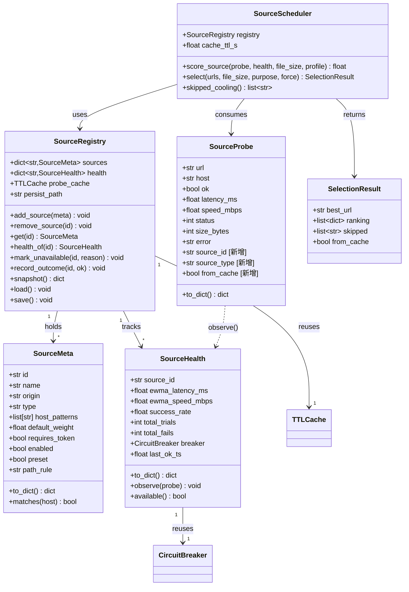
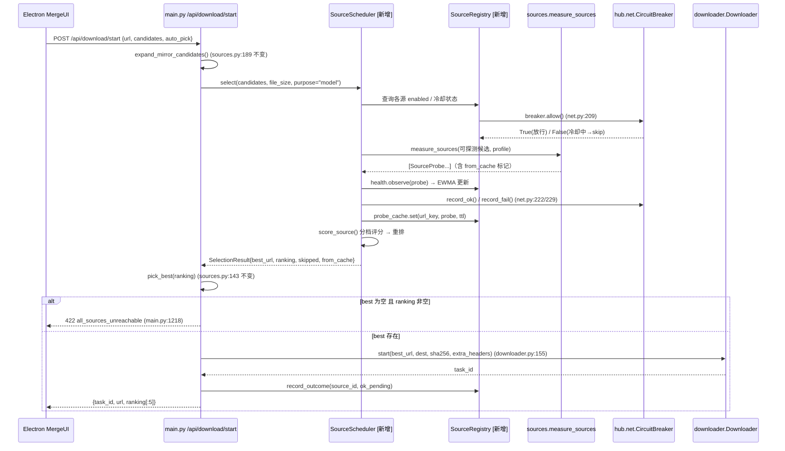
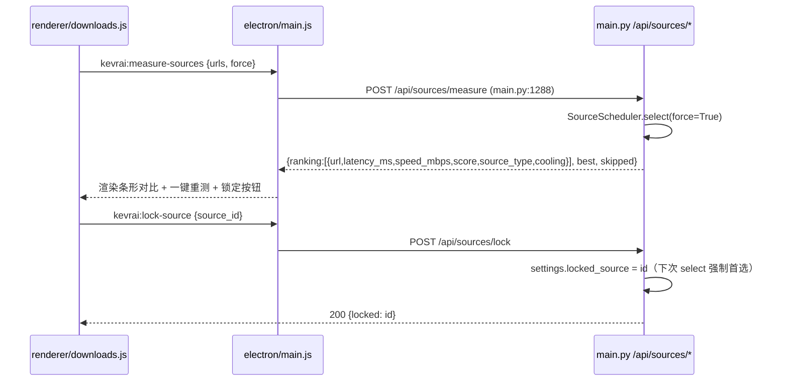
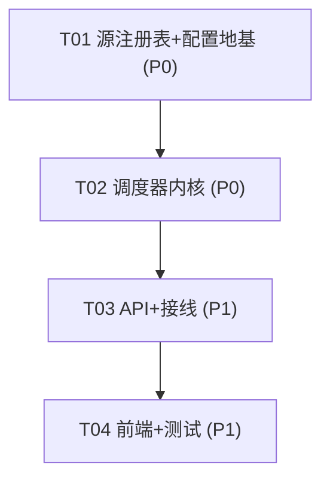

# Kevrai Omni v2.8.1 下载源清单治理 + 自动调度系统强化 设计稿

> ｜　基线版本：v2.8.0　｜　状态：设计稿，**本轮不改任何源码**
>
> **取证声明**：本文所有对现有代码的论断均来自本轮实际读取的文件内容与行号引用，不臆造任何函数/变量/文件。
> 用户实测的源可用性结论**直接采信**，未验证的一律标注。凡设计新增项，均以 `[新增]` 显式标注。

---

## 0. 执行摘要

| 项 | 结论 |
|---|---|
| 问题定位 | 现有 `sources.py`（224 行）**测速—打分—选优链路已完整可用**，本次是**演进扩展**而非重写 |
| 治理核心 | 把「裸 URL 列表」升级为「**源元数据注册表**」：预置源 / 用户源分离、健康度分级、运行时降权 |
| 调度核心 | `_score()` 由**单次线性加权** → **分档评分 + EWMA 历史平滑 + CircuitBreaker 冷却恢复 + TTL 探测缓存** |
| 复用优先 | 冷却恢复**直接复用** `hub/net.py` 的 `CircuitBreaker`；缓存复用 `hub/net.py` 的 `TTLCache`；编排**嵌入** `hub/registry.py` 的既有流程，不另起炉灶 |
| 兼容红线 | `measure_sources` / `pick_best` / `expand_mirror_candidates` **签名与返回结构零改动**，`SourceProbe` 只增字段 |
| GitHub 定位 | 「**引擎二进制源**」（`engines.py` 已在用），纳入统一调度视图但**用途与模型源区分** |
| GitCode | **可插拔、默认不启用**、绝不硬编未验证 URL，附用户自测验证步骤 |
| 任务批次 | **4 批**（T01 源注册表+配置 → T02 调度器内核 → T03 API+接线 → T04 前端+测试） |
| 新增文件 | **5 个**（Python 4 + 测试 1）；修改文件 **6 个** |
| 测试底线 | 现有 471 测试保持全绿、可离线跑；新增测试全部用 mock 源，不依赖真实网络 |

---

## 1. 现状勘查（已读代码，行号基于 v2.8.0 工作区）

### 1.1 已有能力清单（**不重复造**）

| 能力 | 位置 | 现状 |
|---|---|---|
| 并发探测（Range 64KiB 探针） | `python/app/sources.py:71-107` `_probe_one` / `110-140` `measure_sources` | ✅ 成熟 |
| 单次线性打分 | `python/app/sources.py:62-68` `_score` | ⚠️ 待强化 |
| 选首个 ok | `python/app/sources.py:143-148` `pick_best` | ✅ 保留 |
| HF 主机名换镜 | `python/app/sources.py:154-162` `HF_MIRROR_HOSTS` + `175-186` `_swap_host` + `189-226` `expand_mirror_candidates` | ✅ 保留 |
| 探测结果数据类 | `python/app/sources.py:31-52` `SourceProbe` | ✅ 只增字段 |
| 配置项 | `python/app/settings.py:93-101` `extra_model_mirrors` / `auto_pick_best_source` | ⚠️ 待扩展 |
| 测速端点 | `python/app/main.py:1288-1300` `POST /api/sources/measure` | ✅ 保留，增强返回 |
| 编排选择 | `python/app/main.py:1172-1285` `/api/download/start`（`1191-1232` 测速选优 + 422 快速失败）；`main.py:752-775` `/api/env/install` 引擎选速 | ✅ 调用方 |
| 跨源候选拼装 | `python/app/hub/registry.py:234-270` `cross_source_candidates` | ✅ 复用 |
| 熔断器 / TTL 缓存 / 令牌桶 | `python/app/hub/net.py:169-253` `CircuitBreaker`、`55-114` `TTLCache`、`122-161` `TokenBucket` | ✅ **直接复用** |
| 引擎宿主白名单 | `python/app/catalog.py:398-` `is_host_allowed`；`ALLOWED_ENGINE_HOSTS`（`catalog.py:80`，v2.2.0 起为空元组，`engines.py:255,512` 调用） | ✅ 复用 |
| 下载器锁源落盘 | `python/app/downloader.py:125-` `Downloader.start()` / `204` `progress()` | ✅ 不动 |

### 1.2 用户实测源可用性（**直接采信，作为分级依据**）

| 源 | 实测结果 | 判定 |
|---|---|---|
| `hf-mirror.com` | HTTP 200，0.21s | ✅ **可用**（唯一真正可用的 HF 镜像） |
| `hf-mirror.us` | HTTP 000 连接失败 | ❌ 已失效 |
| `hf-cn-mirror.com` | HTTP 000 连接失败 | ❌ 已失效 |
| `huggingface.dl.in.tel` | HTTP 000 连接失败 | ❌ 已失效 |
| `hf-cdn.sufy.com` | HTTP 403（2.4s） | ❌ 反爬拦截 |
| `modelscope.cn`（魔搭） | HTTP 200 | ✅ 可用 |
| `github.com` | 沙箱直连不通（000） | ⚠️ 用于**引擎二进制**（`engines.py`），非模型源 |
| `gitcode.com` | 首页 200；仓库 302；`api.gitcode.com/api/v5/*` 全 404；`raw.gitcode.com/*` → **418 反爬**；SPA 兜底（真/假路径均返回相同 5785 字节 HTML） | ⚠️ **本环境无法证实下载链路** |

**关键结论**：`settings.py:93-99` 的 `extra_model_mirrors` 默认 5 个中 **4 个是死的**。当前 `/api/download/start` 每次下载都会对这 4 个死源各发一次 64KiB 探测（`main.py:1207`），**每次下载白付 4 次超时等待**（`sources.py:26` `PROBE_TIMEOUT = 8.0s`，虽有并发上限 8 但单次仍最长 8s）。这是本设计的**首要治理目标**。

---

## 2. Part A：系统设计

### 2.1 实现路径

#### 2.1.1 核心技术挑战

1. **死源剔除的持久化**：探测一次失败后，必须记住并在运行时降权/剔除，而非每次重试。
2. **量纲可比性**：`speed_mbps * 10.0 - latency_ms * 0.05` 中，10MB/s 提速贡献 100 分，而 100ms 延迟只扣 5 分——**延迟几乎无影响**，且 100MB 与 20GB 文件的选源决策应完全不同。
3. **历史记忆**：单次探测受网络抖动影响大，需 EWMA 平滑；失败需渐进降权而非固定 `-1e9`。
4. **冷却恢复**：死源不能永久拉黑（可能只是临时抖动），需冷却期后自动探测恢复。
5. **未验证源的接入**：GitCode 必须配置化，默认关闭，禁止硬编。

#### 2.1.2 方案选型

| 决策 | 选型 | 理由 |
|---|---|---|
| 状态存储 | **内存注册表 + 可选 JSON 落盘**（源健康度） | 复用 `settings.py` 已有的原子写模式（`settings.py:210-228`）；健康度非关键数据可容忍丢失 |
| 熔断 | **复用 `hub/net.py:169` `CircuitBreaker`** | 已有 N 次失败→open→冷却→half-open→closed 完整语义，测试友好（可注入 `clock`），**禁止重写** |
| 缓存 | **复用 `hub/net.py:55` `TTLCache`** | 已有 TTL + LRU，同样可注入 `clock` 离线测试 |
| 限流 | **复用 `hub/net.py:122` `TokenBucket`** | 控制探测频率，防止对源造成压力 |
| 评分模型 | **纯函数 `score_source(probe, ewma, file_size, profile)`** | 纯函数可离线单测（对齐 `registry.py:96-148` 的纯函数风格） |
| 架构模式 | 分层：`sources.py`（探测） + `sources_registry.py`（注册表/健康度） + `source_scheduler.py`（调度决策） | 高内聚低耦合，纯决策逻辑与 IO 分离 |

#### 2.1.3 与既有编排的协同（**不另起炉灶**）

```
/api/download/start (main.py:1172)
   └─ expand_mirror_candidates()  ← 不变 (sources.py:189)
   └─ [新增] SourceScheduler.select(candidates, file_size, purpose)  ← 包装 measure_sources
        └─ measure_sources()  ← 保留签名 (sources.py:110)
             └─ [新增] probe 前先问 Registry: 该源是否在冷却期? → 命中则跳过探测(省时)
        └─ [新增] 用 EWMA + 分档公式重排 → 返回 ranking(兼容旧结构 + 新字段)
   └─ pick_best()  ← 不变 (sources.py:143)
   └─ Downloader.start()  ← 不变 (downloader.py:155)
   └─ [新增] 下载成功/失败后 Registry.record(outcome) 回写健康度
```

`cross_source_candidates`（`registry.py:234`）与 `expand_mirror_candidates`（`sources.py:189`）均**不改**，只在其下游插入调度器。

### 2.2 文件清单

| 文件 | 动作 | 说明 |
|---|---|---|
| `python/app/sources.py` | **改**（演进） | `_score` 内部调用新评分（保留旧行为兜底）；`SourceProbe` 增 `source_id`/`source_type`/`from_cache` 字段；`measure_sources` 增 `registry`/`profile`/`purpose` 可选参数（默认值=旧行为） |
| `python/app/sources_registry.py` | **新增** | 源元数据注册表：预置源/用户源、类型、默认权重、token 需求、健康度（EWMA + CircuitBreaker 映射）、JSON 落盘 |
| `python/app/source_scheduler.py` | **新增** | 纯决策层：分档评分 `score_source`、`select()` 选源、冷却判断、探测缓存接入 |
| `python/app/settings.py` | **改** | 新增 `source_registry` 相关字段（见 §2.3.3），**保留** `extra_model_mirrors`/`auto_pick_best_source` 兼容 |
| `python/app/main.py` | **改** | `/api/sources/measure` 增强返回（不破坏结构）；新增 `/api/sources/registry`、`/api/sources/lock`、`/api/sources/health` 端点；`/api/download/start` 接入调度器（`main.py:1201-1234` 段） |
| `python/app/hub/registry.py` | **改**（轻） | `files()` 生成 `candidates` 时带上调度器需要的源元数据（`registry.py:459-469` 段），**不改** `cross_source_candidates` |
| `renderer/modules/downloads.js` | **改** | 新增「源测速」可视化面板（复用现有 overlay 风格，不引框架） |
| `renderer/modules/api.js` | **改** | 新增 `api.measureSources` / `api.getSourceRegistry` / `api.lockSource` 薄封装 |
| `electron/main.js` | **改** | 新增 IPC 通道转发（对齐 `main.js:683-687` 既有 `kevrai:measure-sources` 模式） |
| `python/tests/test_source_scheduler.py` | **新增** | 调度器 + 注册表测试（mock 源） |
| `python/tests/test_sources.py` | **改** | 补 `_score` 兼容性断言（现有 5 个用例保留） |

### 2.3 数据结构与接口

#### 2.3.1 类图



> **复用标注**：`CircuitBreaker`（`hub/net.py:169`）、`TTLCache`（`hub/net.py:55`）、`TokenBucket`（`hub/net.py:122`）为**既有类，直接 import 复用**，图中 `reuses` 关系即此意，**不新建**。

#### 2.3.2 源元数据模型（`SourceMeta`）

| 字段 | 类型 | 说明 | 取值 |
|---|---|---|---|
| `id` | str | 稳定标识 | `hf-mirror-com` / `modelscope` / `github` / `gitcode` |
| `name` | str | 展示名 | 「HF 镜像（hf-mirror.com）」 |
| `origin` | str | 源根 | `https://hf-mirror.com` |
| `type` | str | 类型 | `hf_mirror` / `modelscope` / `github_engine` / `gitcode` |
| `path_rule` | str | 路径映射规则 | `hf_path`（保路径换主机）/ `native`（源自有路径）/ `gitcode_api` |
| `default_weight` | float | 默认权重（先验） | 见 §2.4.2 |
| `requires_token` | bool | 是否需 token | `hf-mirror`=需（gated）；`modelscope`=公开读不需 |
| `preset` | bool | 预置 / 用户自定义 | **分级依据核心** |
| `enabled` | bool | 是否启用 | GitCode **默认 false** |

#### 2.3.3 设置项扩展（`settings.py`）

```python
# [新增] 源注册表：用户自定义源（预置源由代码内置，用户源在此追加）
source_registry: list[dict] = Field(default_factory=list)
# 例：[{"id":"my-mirror","origin":"https://my.hf.mirror","type":"hf_mirror",
#        "path_rule":"hf_path","default_weight":1.0,"enabled":true}]

# [新增] 源分级与调度策略
source_health_persist: bool = True          # 健康度是否落盘
probe_cache_ttl_s: int = 300                 # 探测结果缓存 TTL（秒）
probe_concurrency: int = 8                   # 并发探测上限（对齐 sources.py:27）
cooldown_fail_threshold: int = 3             # 连续失败 N 次进入冷却
cooldown_seconds: float = 300.0              # 冷却时长
ewma_alpha: float = 0.4                      # EWMA 平滑系数
size_profile_threshold_mb: int = 512         # 小于此值=小文件档（看延迟），否则大文件档（看吞吐）

# [新增] GitCode 可插拔（默认关闭，未验证）
gitcode_enabled: bool = False
gitcode_repo_api: str = ""                   # 用户自测确认后填入，空=不启用
```

> **兼容**：`extra_model_mirrors`（`settings.py:93`）与 `auto_pick_best_source`（`settings.py:101`）**保持不变**，作为用户源的前身继续工作；注册表在初始化时把它们**归一化导入**为 `preset=False` 的用户源。

### 2.4 调度系统强化设计（核心）

#### 2.4.1 `_score()` 现存 4 个问题的修复对照

| # | 现存问题（`sources.py:62-68`） | 修复方案 |
|---|---|---|
| ① | 纯线性加权，量纲不可比（speed×10 vs latency×0.05） | **归一化 + 分档**：把 latency/speed 各自 min-max 归一化到 [0,1]，再按 profile 加权 |
| ② | 只有单次探测，无历史记忆 | **EWMA** 平滑：`ewma_new = α·sample + (1-α)·ewma_old` |
| ③ | 无带宽/大小感知 | **分档策略**：`file_size` 决定延迟/速度权重（见下） |
| ④ | 失败惩罚固定 `-1e9`，无渐进降权 | **CircuitBreaker 冷却 + 渐进权重**：连续失败进冷却，冷却期跳过，恢复后权重渐升 |

#### 2.4.2 新评分公式（纯函数，可离线单测）

```
score_source(probe, health, file_size, profile) =
    if probe not ok 或 health 熔断 open  →  -inf（排最后，但保留在 ranking 中供 UI 展示）

    # 1) 分档选择权重（profile 可显式覆盖，否则按 file_size 自动判定）
    w_lat, w_spd = choose_profile_weights(file_size, profile)
        size < size_profile_threshold_mb:
            → (latency=0.6, speed=0.4)   # 小文件：首字节延迟主导
        size >= size_profile_threshold_mb:
            → (latency=0.2, speed=0.8)   # 大文件：持续吞吐主导

    # 2) 归一化（在一次 ranking 内对所有 ok 源做 min-max）
    lat_norm = 1 - norm(latency_ms)      # 越低越高分
    spd_norm = norm(speed_mbps)          # 越高越高分

    # 3) 历史平滑（EWMA 融合本次实测与历史）
    lat_eff = α·latency_ms      + (1-α)·health.ewma_latency_ms
    spd_eff = α·speed_mbps      + (1-α)·health.ewma_speed_mbps
    （用 lat_eff/spd_eff 替换第 2 步的原始值再归一化）

    # 4) 成功率与权重修正
    base = w_lat·lat_norm + w_spd·spd_norm
    score = base · health.success_rate · meta.default_weight
```

- **`success_rate`**：`1 - total_fails / max(1, total_trials)`，**渐进降权**替代固定 `-1e9`。
- **`default_weight`**：预置可信源先验权重略高，未验证源（GitCode）先验低，用户自定义源 1.0。
- **`α`（`ewma_alpha`）**：默认 0.4，兼顾响应与稳定；测试可冻结。

#### 2.4.3 分档策略示例

| 场景 | 文件大小 | 权重（延迟/吞吐） | 直觉 |
|---|---|---|---|
| 小配置文件 / LoRA | 2 MB | 0.6 / 0.4 | 连接快者胜 |
| 中等模型 | 4 GB | 0.2 / 0.8 | 带宽决定总时长 |
| 超大模型分片 | 20 GB | 0.2 / 0.8 | 同上，吞吐绝对主导 |

#### 2.4.4 故障记忆与恢复（**复用 `CircuitBreaker`**）

```
探测前：
    if not health.breaker.allow():        # hub/net.py:209
        → 跳过本次探测，记入 SelectionResult.skipped，加入 ranking 末位并标 cooling
探测后：
    ok      → health.breaker.record_ok()      # hub/net.py:222
    fail    → health.breaker.record_fail()    # hub/net.py:229（累计达阈值→open）
冷却期结束 → state 自动转 HALF_OPEN（net.py:196-199），放行一次试探
试探成功 → closed（恢复）；试探失败 → 重新 open 完整冷却（net.py:233-237）
```

**收益**：死源（如 `hf-mirror.us`）3 次失败后进入 300s 冷却，**冷却期内不再探测**，`/api/download/start` 不再为它白等——直接解决 §1.2 的核心痛点。

#### 2.4.5 探测缓存

- 复用 `TTLCache`（`hub/net.py:55`），key = `normalized(url + file_size_bucket)`，TTL = `probe_cache_ttl_s`（默认 300s）。
- 命中缓存 → 直接复用探测结果，`from_cache=True`（`SourceProbe` 新字段）。
- 用户点「一键重新测速」时传 `force=True` 绕过缓存。

#### 2.4.6 并发探测上限

- 继承 `measure_sources` 的 `concurrency`（`sources.py:114`，默认 `PROBE_CONCURRENCY = 8`，`sources.py:27`）。
- 新增 `TokenBucket` 兜底（防止高频重测打爆源），`rate` 与 `capacity` 由设置项控制。

#### 2.4.7 与 `hub/registry.py` 的协同

- `registry.py:459-469` 的 `files()` 在生成每文件 `candidates` 时**额外附** `source_meta`（源元数据），供前端展示源类型/权重。
- `cross_source_candidates`（`registry.py:234-270`）**完全不动**——它已正确产出 URL 候选，调度器在其下游工作。
- 调度器**不持有** registry 实例，而是通过 `main.py` 注入的 `SourceRegistry`（`app.state.source_registry`）共享，避免循环依赖（对齐 `net.py:10-14` 的注释原则）。

### 2.5 GitHub 定位设计

**结论：GitHub = 引擎二进制源，非模型源。**

- GitHub 已在 `engines.py` 使用：`install()`（`engines.py:245-349`）、`download_zip_engine()`（`engines.py:511-533`）、`check_engine_updates()`（`engines.py:663-744` 走 `api.github.com/repos/.../releases/latest`）。
- 宿主校验走 `is_host_allowed(url, ALLOWED_ENGINE_HOSTS)`（`engines.py:255,512`；`catalog.py:398`）。
- **统一视图**：在 `SourceRegistry` 中登记一条 `type="github_engine"` 的 `SourceMeta`（`origin="https://github.com"`，`default_weight` 略高），使 `/api/sources/registry` **一个端点即可看到全部源**（模型源 + 引擎源）。
- **用途区分**：
  - 模型下载链路（`/api/download/start`）**不会**把 `github.com` 纳入候选（`expand_mirror_candidates` 对非 HF 主机返回单元素，`sources.py:213-214`；`test_mirror_expand.py:45-49` 已验证）。
  - 引擎安装链路（`/api/env/install`，`main.py:752-775`）通过调度器按 `purpose="engine"` 查询，使用引擎源视图。
  - 二者**共用** `measure_sources` + `SourceScheduler`，但候选集由 `purpose` 参数隔离。

### 2.6 GitCode 可插拔设计（**默认不启用**）

**红线遵守**：本环境**无法证实** GitCode 下载链路（首页 200 / 仓库 302 / API 404 / raw 418 反爬 / SPA 兜底），因此：

1. `SourceMeta` 中 GitCode 条目 `enabled=False`、`preset=True` 但 `default_weight` 低。
2. `settings.py` 新增 `gitcode_enabled: bool = False`（§2.3.3），**默认关闭**。
3. `gitcode_repo_api` 默认 `""`（空=不启用），**绝不硬编任何未验证 URL**。
4. 调度器对 `type="gitcode"` 的源：`enabled=False` 时**直接排除**，不参与探测。
5. UI 中 GitCode 显示为「未启用 · 需自测」状态。

**用户自测验证步骤（写进文档与 UI 提示）**：

```
1. 打开设置 → 下载源 → GitCode，填入你自测确认的仓库 API 模板。
2. 用 curl 手动验证（示例，路径以你确认为准）：
   curl -iL "https://<你确认的下载直链>" -H "Range: bytes=0-65535"
   期望：HTTP 200/206 且返回非 HTML 二进制体（非 418/302-兜底）。
3. 若返回 418 或 SPA HTML（含 <html> 且长度≈5785），说明该链路不可用，**请勿启用**。
4. 确认可下载后，勾选「启用 GitCode」并把模板/直链规则填入 → 保存。
5. App 内点「源测速」，看到 GitCode 源 ok=true 且速度>0，即表示接入成功。
```

**实现级别**：GitCode 的 URL 生成器为**可插拔函数** `build_gitcode_candidates(repo, path, template)`，模板为空时返回 `[]`，不影响其它源。

### 2.7 Anything UNCLEAR（假设与待确认）

| # | 项 | 处理 |
|---|---|---|
| 1 | GitCode 真实下载链路 | **【未验证】** 设计为配置化、默认关闭，附自测步骤；实现前需用户实测确认 |
| 2 | `hf-mirror.us`/`hf-cn-mirror.com` 等死源是否永久移除 | 不删。改为 `SourceMeta` 中 `enabled=False`+记「实测不可用」，避免历史用户自定义配置丢失 |
| 3 | 引擎源与模型源是否需不同评分权重 | 设计上通过 `purpose` 参数区分，默认引擎源 `w_spd` 更高（二进制包大） |
| 4 | EWMA α 与冷却阈值最优值 | 给出默认值（0.4 / 3 次 / 300s），实现后按实测调优 |
| 5 | 健康度落盘格式 | 复用 `settings` 原子写模式（`settings.py:210-228`），路径 `default_data_root()/source_health.json` |

### 2.8 程序调用流程





---

## 3. Part B：任务分解

### 3.1 依赖包

**无新增第三方依赖。** 全部复用现有：`httpx`（已在 `pyproject.toml` 依赖）、`pydantic`、`fastapi`。前端保持零框架（原生 JS + CSS）。

### 3.2 任务列表（4 批，按依赖排序）

#### T01：源注册表 + 配置地基 【P0】

| 项 | 内容 |
|---|---|
| **任务名** | 源元数据注册表与设置项扩展 |
| **源文件** | `python/app/sources_registry.py`【新增】、`python/app/settings.py`【改】 |
| **依赖** | 无 |
| **文件数** | 2 |
| **验收标准** | ① `SourceRegistry` 可登记预置源（hf-mirror.com 启用；4 个死源 enabled=False）；② `extra_model_mirrors` 能归一化导入为 `preset=False` 用户源；③ 设置新增字段加载/保存往返一致且**不破坏** `test_settings.py`/`test_settings_persistence.py`；④ 复用 `hub/net.py` 的 `TTLCache`/`CircuitBreaker`，无重复实现 |

#### T02：调度器内核（评分 + 分档 + 冷却 + 缓存）【P0】

| 项 | 内容 |
|---|---|
| **任务名** | 分档评分、EWMA 平滑、冷却恢复、探测缓存 |
| **源文件** | `python/app/source_scheduler.py`【新增】、`python/app/sources.py`【改：`_score`/`SourceProbe`/`measure_sources` 增可选参数】 |
| **依赖** | T01 |
| **文件数** | 2 |
| **验收标准** | ① `score_source` 为纯函数，小文件档延迟主导、大文件档吞吐主导（可离线断言）；② EWMA 平滑生效（同源历史影响评分）；③ 死源 3 次失败后 `breaker.allow()` 返回 False，冷却期跳过探测；④ `measure_sources`/`pick_best`/`expand_mirror_candidates` **签名与返回结构不变**，`test_sources.py`、`test_mirror_expand.py`、`test_download_start.py` 全绿；⑤ `SourceProbe.to_dict()` 只增字段不删 |

#### T03：API 端点 + 编排接线 【P1】

| 项 | 内容 |
|---|---|
| **任务名** | 新增源管理端点，`/api/download/start` 接入调度器 |
| **源文件** | `python/app/main.py`【改】、`python/app/hub/registry.py`【改：`files()` 附 source_meta】、`electron/main.js`【改：IPC 转发】 |
| **依赖** | T02 |
| **文件数** | 3 |
| **验收标准** | ① 新增 `/api/sources/registry`、`/api/sources/health`、`/api/sources/lock`；② `/api/sources/measure` 返回兼容旧结构并**增** `score`/`source_type`/`cooling` 字段；③ `/api/download/start` 冷却期源被跳过，不再白等；④ 422 快速失败行为不变（`test_download_start.py` 全绿）；⑤ `cross_source_candidates` 未改 |

#### T04：前端源测速可视化 + 测试补全 【P1】

| 项 | 内容 |
|---|---|
| **任务名** | 下载面板源测速可视化与测试 |
| **源文件** | `renderer/modules/downloads.js`【改】、`renderer/modules/api.js`【改】、`python/tests/test_source_scheduler.py`【新增】、`python/tests/test_sources.py`【改】 |
| **依赖** | T03 |
| **文件数** | 4 |
| **验收标准** | ① 各源延迟/速度条形对比渲染正常，含「未启用/冷却中」状态；② 一键重新测速（`force=true`）与手动锁定源可用；③ 零前端框架引入；④ 新测试全 mock 源、离线可跑；⑤ 全套 471+ 测试全绿 |

### 3.3 共享知识（跨任务约定）

```
- 所有新增 API 响应保持既有风格：端点返回裸 dict（对齐 /api/sources/measure 的 {"ranking":[...], "best":...}），
  不引入 {code,data,message} 包装（本项目未使用该约定，保持一致）。
- SourceProbe.to_dict() 只允许【新增】字段，禁止删改既有键（url/host/ok/latency_ms/speed_mbps/status/size_bytes/error）。
- 时间统一用 time.monotonic()（对齐 hub/net.py）；落盘时间戳用 ISO 8601 UTC（对齐 engines.py:_now_iso）。
- 熔断/TTL 缓存一律从 hub/net.py 导入，禁止在 sources 侧另写一份。
- 所有网络探测必须可离线 mock：scheduler 的 clock/cache 可注入（对齐 hub/net.py §注释）。
- 源 id 用 kebab-case（hf-mirror-com / gitcode / modelscope / github）。
```

### 3.4 任务依赖图



---

## 4. 测试策略

### 4.1 源调度器单测（mock 慢/快/失败源）

| 用例 | 构造 | 断言 |
|---|---|---|
| 选优正确性 | 3 个 mock `SourceProbe`：快(50ms/20MB/s)、慢(200ms/5MB/s)、失败(ok=False) | `select()` 返回快的 URL |
| 小文件档 | 同一组 probe，`file_size=5MB` | 延迟最低者排第一 |
| 大文件档 | 同一组 probe，`file_size=8GB` | 吞吐最高者排第一 |
| EWMA 平滑 | 同源连续喂 慢→快 两次 | 第二次评分被历史拉低（介于两者间） |
| 冷却跳过 | 对一源 record_fail ×3，冻结 clock | `breaker.allow()`=False，`select().skipped` 含该源 |
| 冷却恢复 | 冻结 clock 前进 cooldown_seconds | 状态转 half-open，再次探测被放行 |
| 缓存命中 | 首次 select 后二次 select（未 force） | `from_cache=True`，未发起新探测 |
| 缓存失效 | `force=True` | 重新探测 |

### 4.2 极端场景

| 场景 | 期望行为 |
|---|---|
| **全部源失败** | `select()` best=None，ranking 非空 → `/api/download/start` 返回 422（沿用 `main.py:1218`），**不**启动后台任务 |
| **源速度剧烈波动** | EWMA 抑制单次尖峰；评分不因一次抖动误选 |
| **探测超时** | `SourceProbe.ok=False`，`error` 记超时；`breaker.record_fail()`；不影响其它源（并发 `gather` 隔离，`sources.py:137`） |
| **并发探测** | 上限 `probe_concurrency`（默认 8，`sources.py:27`）；`TokenBucket` 兜底；不超发 |
| **源返回错误大小** | probe `size_bytes` 明显异常（如 0 或远超 `PROBE_RANGE`）→ 降权处理，不选中 |
| **所有源冷却中** | ranking 全为 cooling 条目 → 422 且提示「所有源冷却中，稍后重试」 |
| **GitCode 未启用** | 完全不出现在候选/探测中，零网络开销 |

### 4.3 离线保证

- 所有新测试用 mock `SourceProbe` 或 `monkeypatch.setattr("app.sources.measure_sources", fake)`（对齐 `test_download_start.py:60-66` 既有模式）。
- 不新增真实网络用例。既有 `test_sources.py:109-123` 的联网用例保持现状（不新增同类）。

### 4.4 回归红线

- `python/tests/test_sources.py`（5 用例）、`test_mirror_expand.py`（6 用例）、`test_download_start.py`（5 用例）**必须全绿**。
- `pyproject.toml` 的 `addopts = "-ra --strict-markers -m 'not live'"` 保持离线默认。

---

## 5. 迁移与兼容矩阵

| 现有符号 | 位置 | 变更 | 兼容性 |
|---|---|---|---|
| `measure_sources` | `sources.py:110` | 增**可选** `registry`/`profile`/`purpose` 参数（有默认值） | ✅ 调用方不变可跑 |
| `pick_best` | `sources.py:143` | 不变 | ✅ |
| `expand_mirror_candidates` | `sources.py:189` | 不变 | ✅ |
| `_score` | `sources.py:62` | 内部改用 `score_source`，无 registry 时回退旧公式 | ✅ `test_sources.py:65-74` 仍过 |
| `SourceProbe` | `sources.py:31` | 只增字段 | ✅ `to_dict` 向后兼容 |
| `extra_model_mirrors` | `settings.py:93` | 保留，归一化导入注册表 | ✅ |
| `auto_pick_best_source` | `settings.py:101` | 保留 | ✅ |
| `cross_source_candidates` | `registry.py:234` | 不变 | ✅ |
| `POST /api/sources/measure` | `main.py:1288` | 返回结构只增字段 | ✅ |
| `POST /api/download/start` | `main.py:1172` | 422 行为不变，仅内部接入调度器 | ✅ |
